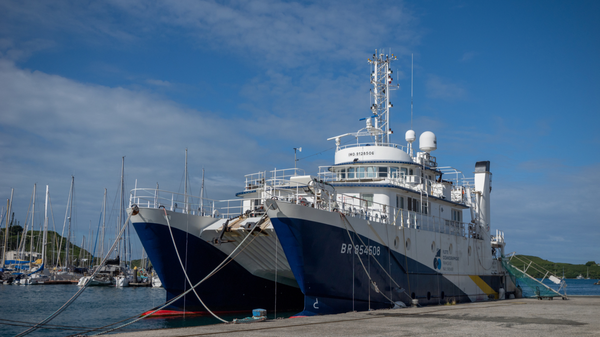
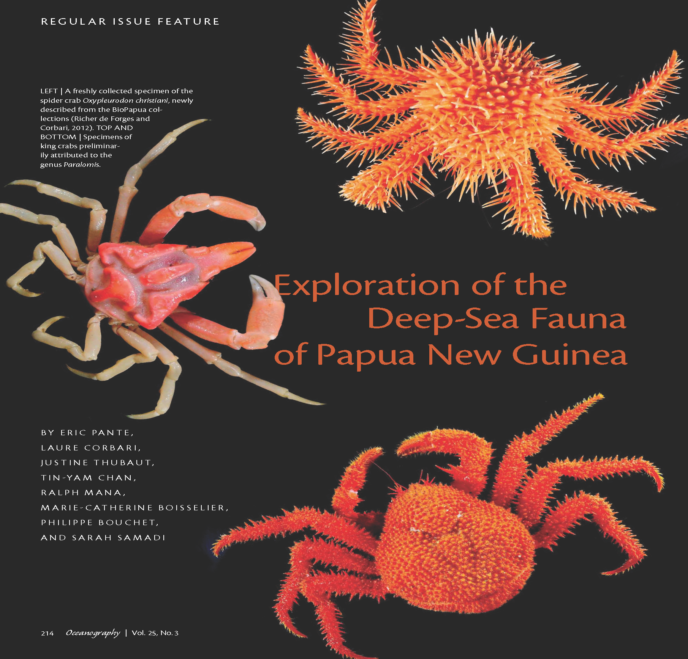

The DAUNPAPUA expedition, scheduled for June–July 2025, is the fifth mission of the Tropical Deep-Sea Benthos ([TDSB](https://www.mnhn.fr/en/tropical-deep-sea-benthos)) program in Papua New Guinea (PNG). Coordinated by the [Laboratory for the Study of Marine Environments](https://www-iuem.univ-brest.fr/lemar/the-lab/?lang=en) (Brest, France) and the [Muséum national d’Histoire naturelle](https://www.mnhn.fr/fr) (MNHN, Paris, France), in partnership with the University of Papua New Guinea (UPNG), this scientific expedition aims to continue the inventory of deep-sea benthic biodiversity in one of the richest areas in the world: the Exclusive Economic Zone (EEZ) of PNG.

To achieve this, we are deploying the oceanographic vessel [ANTEA](https://www.flotteoceanographique.fr/Nos-moyens/Navires-engins-et-equipements-mobiles/Navires-semi-hauturiers/Antea) (photo), part of the French Oceanographic Fleet, for a duration of 38 days.

{fig-align="center"}

## **Scientific Objectives**

The DAUNPAPUA expedition has three main objectives:\
– Explore the southern part of PNG’s EEZ, a region still largely unknown despite its potential in marine biodiversity, notably Milne Bay, Goodenough Bay, Dyka Ackland Bay, and the Gulf of Papua.\
– Study connectivity mechanisms among deep-sea benthic communities in the region to understand how species disperse and evolve.\
– Analyse the evolutionary processes responsible for the faunal richness of the Southwest Pacific through sampling across various habitats such as seamounts, canyons, and cold seeps.

{fig-align="center"}

## **Historical and Scientific Context**

The TDSB program, launched in the 1970s, has enabled over 70 expeditions and the publication of more than 1,500 scientific articles. In PNG, previous expeditions (BIOPAPUA, MADEEP, PAPUANIUGINI, KAVIENG) led to the discovery of hundreds of new species, reinforcing the region’s status as a global hotspot of marine biodiversity. However, much of the southern EEZ remains unexplored.

Historically, the region was not well covered by the major oceanographic expeditions of the 20th century. The few existing data on PNG’s deep-sea fauna come from highly specialized hydrothermal vent zones, leaving most of the benthic biodiversity still unknown.

## **An Exceptional Territory**

Papua New Guinea is located at the heart of the Coral Triangle, home to about 75% of the world’s coral species. While terrestrial and coastal biodiversity are relatively well documented, the deep-sea fauna remains largely unknown. The DAUNPAPUA project aims to fill this gap by providing crucial data for fundamental research and conservation.

## **Awareness and Local Engagement**

DAUNPAPUA goes beyond research: it includes an active awareness component. Two public engagement programs are planned in Port Moresby and Alotau, in partnership with UPNG. These will bring together DAUNPAPUA researchers, Provincial Government representatives, local institutional representatives, and the French Embassy for presentations and specimen exhibitions. These actions aim to share scientific knowledge with local communities and foster dialogue around the sustainable management of marine resources.

## **International Context: the 3rd United Nations Ocean Conference**

The expedition is aligned with the 3rd United Nations Ocean Conference (UNOC 2025). It directly contributes to Sustainable Development Goal 14, which targets the conservation of oceans, by enhancing knowledge of deep-sea ecosystems—vital but vulnerable systems often overlooked in marine protection strategies. The integration of DAUNPAPUA data into major international databases will support better global governance of marine biodiversity.
