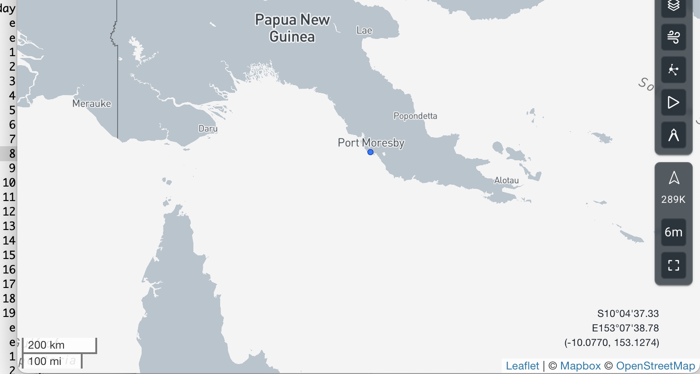
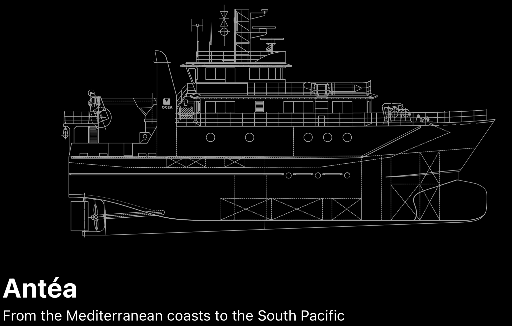

NO ANTEA, the oceanographic vessel that will be our home for the next 38 days, arrived in Port Moresby yesterday, Monday 16. You can check its position in quasi-real time using the [Marine Traffic](https://www.marinetraffic.com/en/ais/details/ships/shipid:180761)website.

{fig-align="center"}

NO ANTEA is a versatile 35-meter oceanographic vessel designed for coastal and offshore missions in the Mediterranean, Indian Ocean, and tropical Atlantic regions. With its shallow draft (3.3 m), ANTEA is particularly well-suited for nearshore research and operations in constrained or reef-laden waters, such as in Papua New Guinea. The ship is powered by a diesel-electric propulsion system. It is owned by the IRD (Institut de Recherche pour le Développement), operated by Ifremer, with technical management provided by Genavir. Commissioned in 1995, ANTEA carries the IMO number 9128506 and callsign FNUR, and is recognized for its adaptability in supporting multidisciplinary scientific missions. As part of the French Oceanographic Fleet, it plays a key role in providing access to marine environments in France’s overseas territories.

Find out more about ANTEA on the[French Oceanographic Fleet](https://www.flotteoceanographique.fr/en/Facilities/Vessels-Deep-water-submersible-vehicles-and-Mobile-equipments/Overseas-vessels/Antea) and the [Ifremer](https://www.ifremer.fr/en/flotte-oceanographique-francaise/decouvrez-les-navires-de-la-flotte-oceanographique-francaise/l-antea).

{fig-align="center"}
