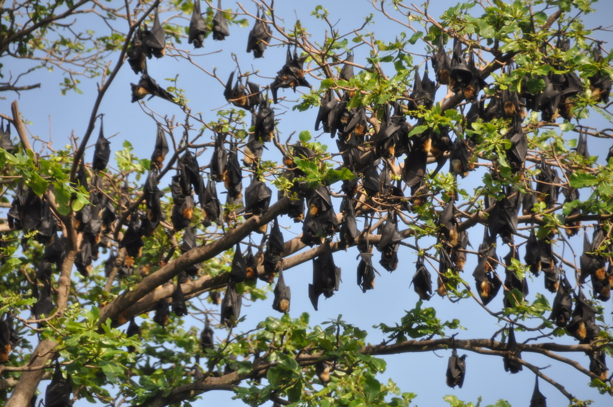
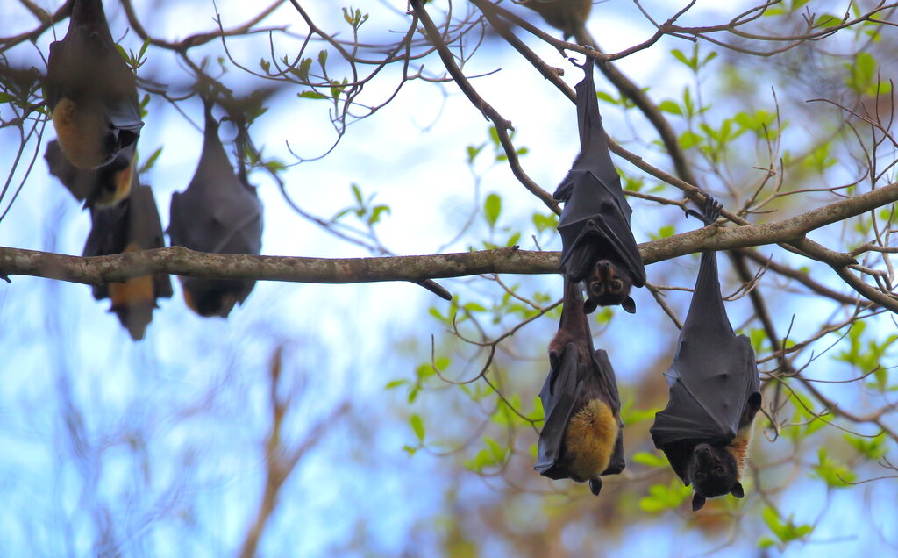

We see ANTEA from the hotel we are staying at, waiting for the cruise to commence. This morning at sunset (\~6:30am), hundred of giant bats flew over the ANTEA. Unfortunately I could not take a good photo, but I think the bats were spectacled flying foxes of the genus *Pteroptus*. Below is a picture taken by [peterchristiaen](https://www.inaturalist.org/people/peterchristiaen) and [posted on iNaturalist](https://www.inaturalist.org/observations/179680789).

{fig-align="center"}

Although it is an amazing spectacle to watch hundreds of large flying foxes in at sunset, I was told that they keep increasing in numbers in Port Moresby, creating problems, as described in this article from the [National newspaper](https://www.thenational.com.pg/flying-foxes-becoming-a-threat-to-city-park/). Port Moresby’s Nature Park has been overrun by thousands of spectacled flying foxes that swoop in each breeding season, coating trees (and visitors) with noise, smell and guano. Flying foxes can also carry diseases such as rabies and ebola, and perturb aerial traffic. Staff say the bats’ mass roosting is damaging foliage, short-circuiting lights and denting the park’s tourism appeal, so managers are weighing humane ways to thin or relocate the colony. Nevertheless, the National Park emphasizes that [the spectacled flying fox is an integral part of the Port Moresby ecosystem.](https://www.thenational.com.pg/flying-foxes-no-threat-park-management/) Wildlife advocates counter that any action must protect the bats, which are key pollinators and seed-dispersers for PNG’s forests. The debate now centres on finding a fix that keeps the park pleasant without harming these ecologically important “sky gardeners.”

But the spectated flying fox populations are not doing great within its natural range, which spans from PNG to North Queensland (picture below: [Noel Preece](https://www.newsport.com.au/2025/june/new-projects-to-reverse-decline-of-spectacled-flying-fox-in-far-north-queensland)). Two fresh federal grants worth a combined AU\$2 million have just been awarded to save Far North Queensland’s endangered spectacled flying-fox ([news from 06/2025](https://www.newsport.com.au/2025/june/new-projects-to-reverse-decline-of-spectacled-flying-fox-in-far-north-queensland)). Led by Terrain NRM, ecologists, Traditional Owners and James Cook University scientists will map roosts and feeding routes, replant cyclone-damaged rainforest, and trial fixes for threats such as tick paralysis, barbed wire and killer heatwaves. The four-year program also promises smarter population monitoring tools after numbers crashed from 250 000 to about 75 000—and another 23 000 bats died in the 2018 heatwave. Project leaders say protecting this “sky-gardener” is critical for pollinating and reseeding the Wet Tropics World Heritage forests.

{fig-align="center"}
