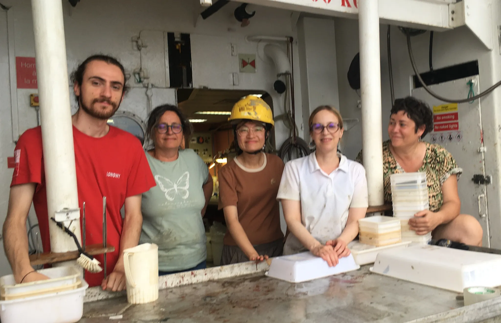
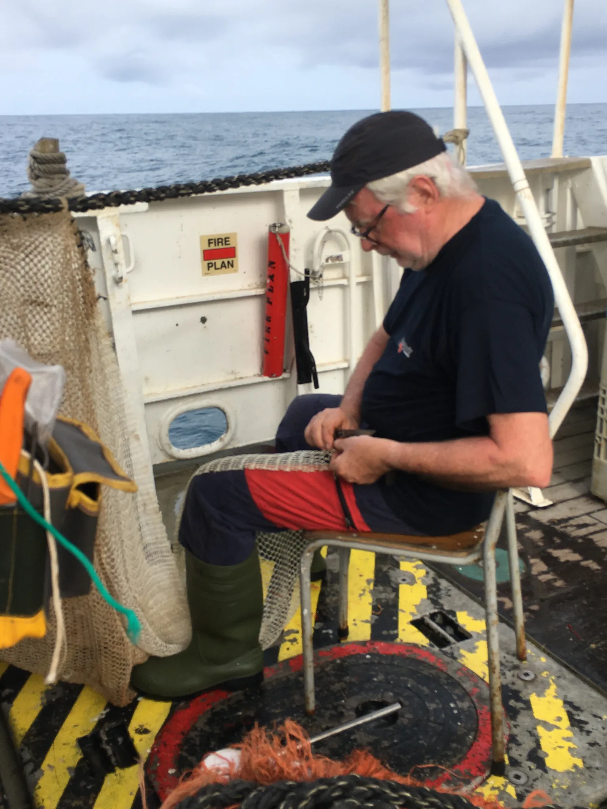

Meet the scientific team behind Leg 1 of the DAUNPAPUA expedition—a dynamic crew blending early-career energy with deep-sea expertise. PhD students Dero Wang and Brice Morhain are diving into the depths of biodiversity, with Dero focusing on the taxonomy and evolution of black corals, and Brice specializing in annelid worms. Claire Laguionie, a lecturer at CNAM-Intechmer, brings her expertise in echinoderms and annelids, while Laure Corbari, faculty member at the French National Museum of Natural History (MNHN), contributes her deep knowledge of crustaceans and deep-sea sampling. The expedition is co-led by Sarah Samadi (MNHN), an expert in mollusks and corals, and Eric Pante (CNRS), a marine molecular ecologist working on the evolution of deep-sea corals. Rounding out the team is Jean-François “Jeff” Barazer, a retired ship captain and long-time MNHN volunteer with extensive experience from past Tropical Deep-Sea Benthos expeditions. Together, this passionate team is exploring the hidden biodiversity of the Gulf of Papua and the southern Solomon Sea.

{fig-align="center"}

{fig-align="center"}
