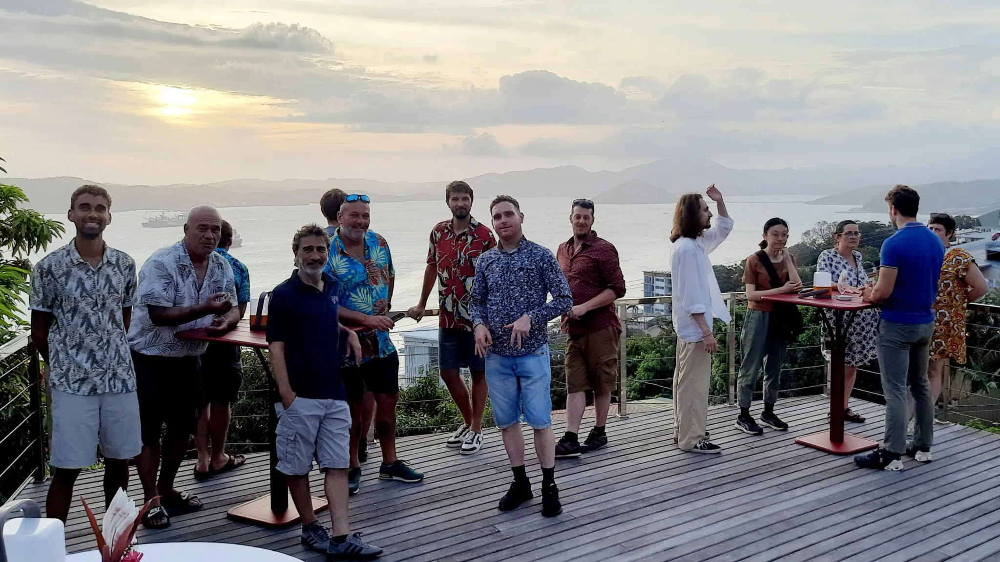

On the evening of June 18, we had the pleasure of joining an informal gathering hosted by the French Embassy in Papua New Guinea. Set on the scenic heights of Port Moresby, this cocktail reception offered stunning views and even better company, bringing together scientists, policymakers, educators, and students in a celebration of shared purpose and collaboration.

The French Embassy has been a key ally in the planning of our scientific expedition, playing an instrumental role in navigating the legal framework that underpins such an international effort. Their support was crucial in securing official documentation like the *note verbale*—a formal diplomatic communication used to request authorizations or express intentions between governments. In our case, it was essential for securing research permissions and coordinating with local authorities.

This evening was more than a social event—it was an opportunity to connect with important stakeholders in Papua New Guinea’s scientific and environmental community. We were delighted to meet with representatives from the Conservation and Environment Protection Authority (CEPA), faculty and students from the University of Papua New Guinea (UPNG), and educators dedicated to strengthening local scientific capacity. These connections are invaluable for building lasting partnerships that extend beyond the duration of our expedition.

The reception was attended by both the scientific team and the crew of the research vessel *ANTEA*, reflecting the truly collaborative spirit of our mission. We are deeply grateful to the French Embassy for this warm welcome and for their continued support. Events like these remind us that science thrives not only in the lab or at sea, but also in the conversations, trust, and goodwill that connect people across institutions and borders.

{fig-align="center"}
