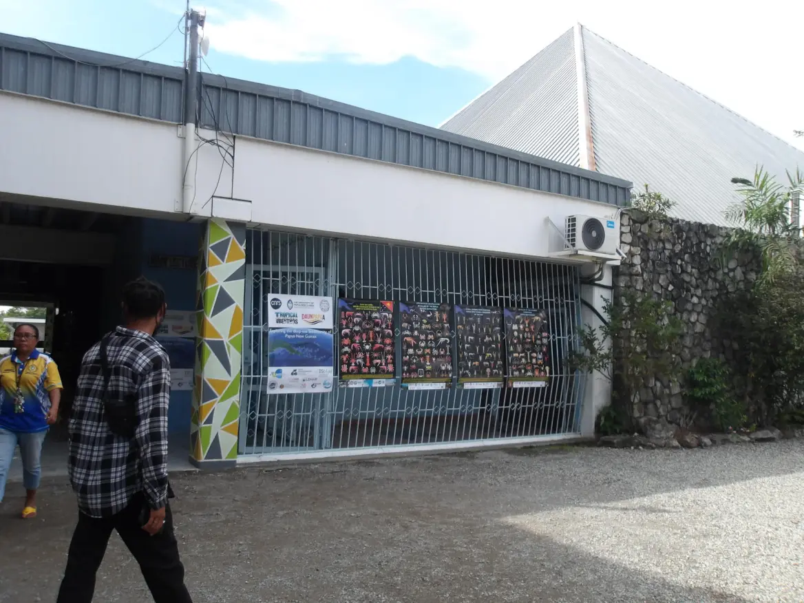{fig-align="center"}

On June 27, after a week of scientific exploration at sea, the *DAUNPAPUA* team returned to Port Moresby for a full day of dialogue and exchange at the **University of Papua New Guinea (UPNG)**. This event marked a meaningful opportunity to reconnect with local partners—students, professors, and institutional representatives—and to share both the goals of the current expedition and the broader legacy of deep-sea research in Papua New Guinea.

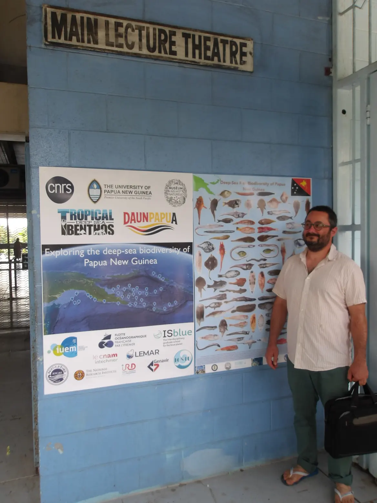{fig-align="center"}

Building on the momentum of previous collaborations, we presented four books published as a result of earlier expeditions in PNG waters. These volumes showcase the region’s exceptional marine biodiversity and highlight the contributions of joint research between local and international scientists. In the same spirit, we brought with us a reference collection of mollusks and crustaceans, which will now be housed at UPNG to support education, training, and future taxonomic research.

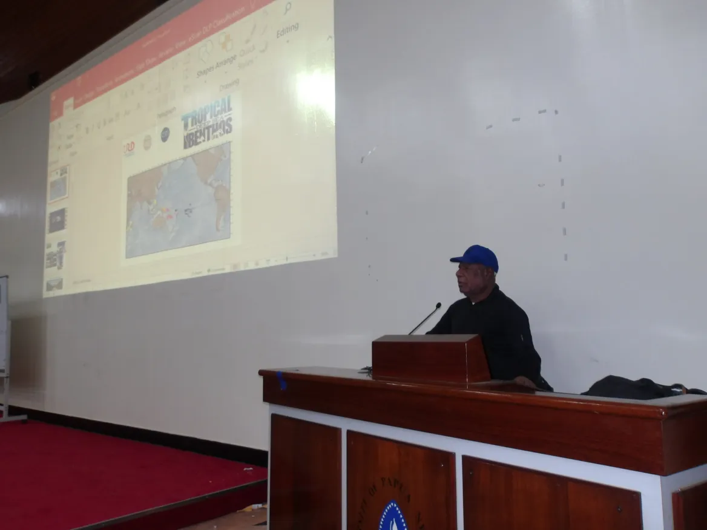{fig-align="center"}

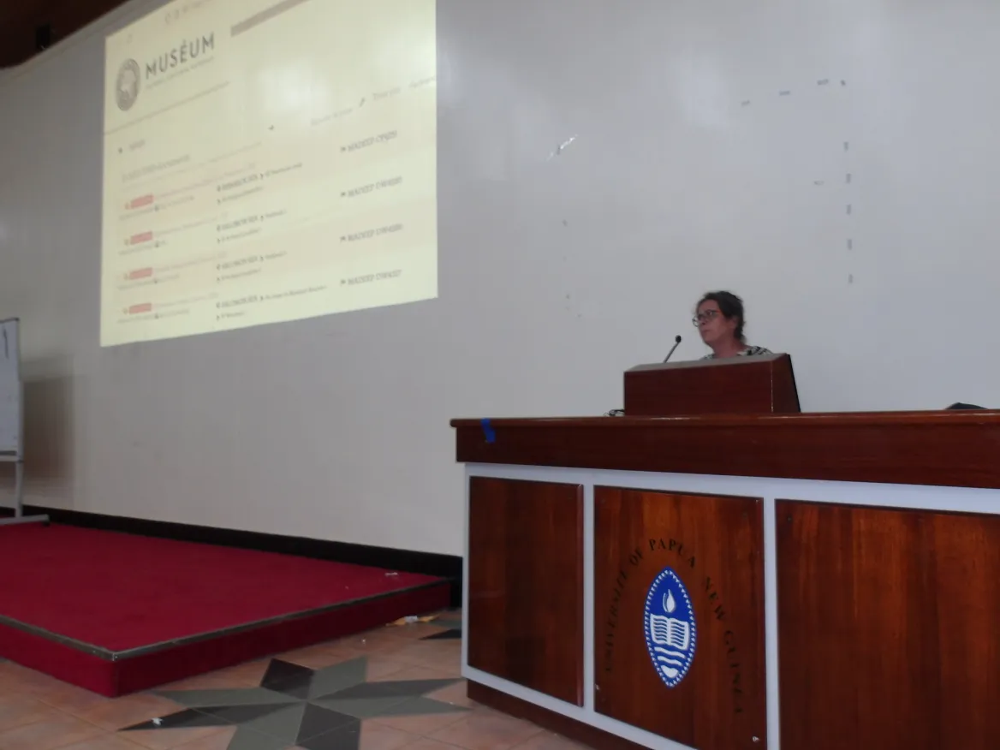{fig-align="center"}

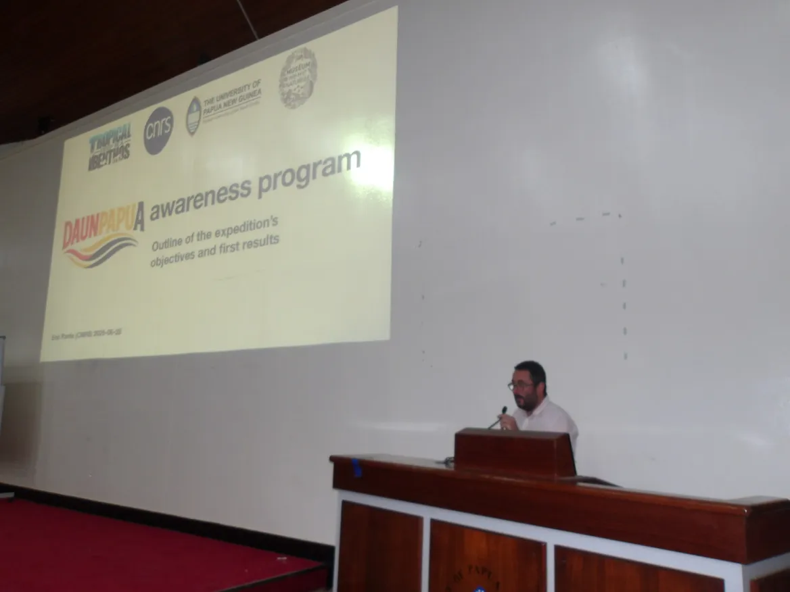

The day’s presentations began with **Sarah Samadi**, who introduced the origins and scope of the **Tropical Deep-Sea Benthos research program**—a decades-long initiative aimed at exploring and documenting the biodiversity of deep-sea ecosystems across the Indo-Pacific. She explained the scientific approaches used in this program and illustrated them by screening a video from the **SPANBIOS** cruise, offering a behind-the-scenes look at how samples are collected and studied aboard deep-sea expeditions.



Following this, I provided an overview of the DAUNPAPUA cruise itself—its motivations, scientific objectives, and the results from the first eight days at sea. This included a discussion of the areas explored, preliminary observations, and the broader ecological and conservation questions the expedition seeks to address.

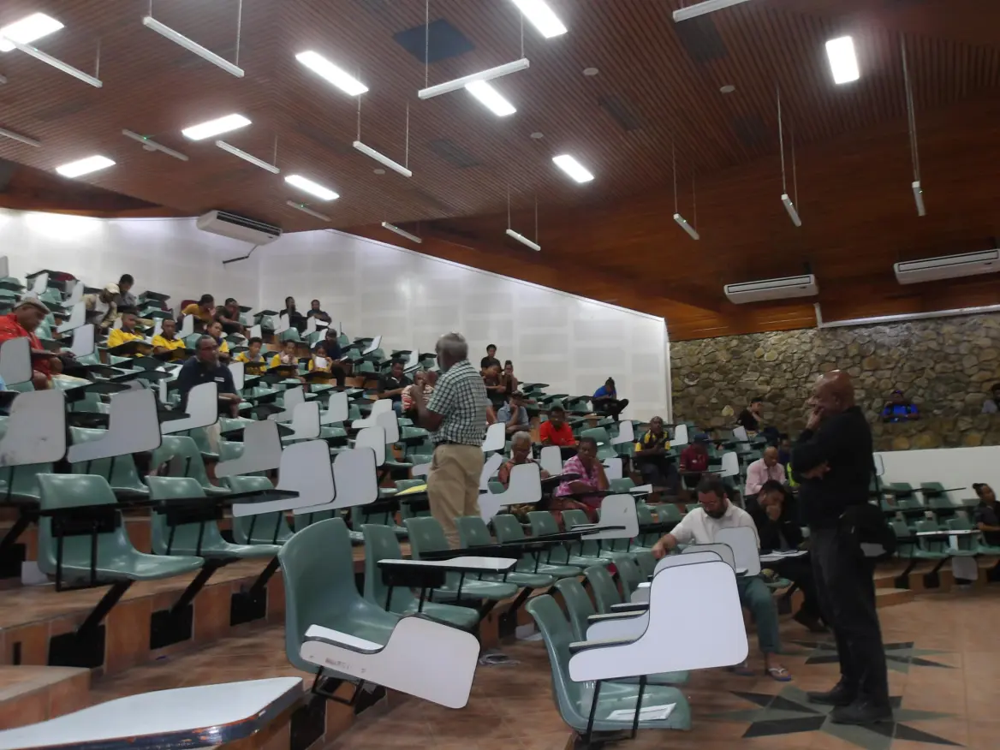{fig-align="center"}

fter an engaging morning of presentations at the University of Papua New Guinea, it was time to bring the science to life. We boarded a bus with our guests and headed down to the historic Port Moresby wharf, where the research vessel *ANTEA*was docked. The atmosphere was buzzing with curiosity and excitement as our visitors—students, professors, and representatives from local institutions—prepared to step aboard a ship that had just returned from the depths of the Gulf of Papua.

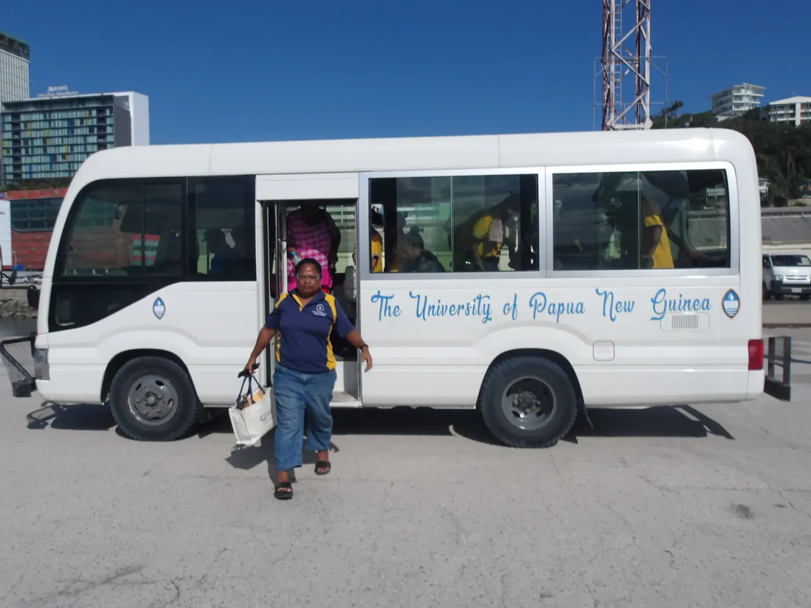{fig-align="center"}

Once on board, we guided them through the different parts of the vessel. We started with the *gear*—winches, trawl, and dregdes used to explore the seafloor hundreds of meters below. From there, we visited the *wet lab*, where samples are first processed, and the *dry lab*, where initial identifications and data recordings are done. We then moved to the *scientific headquarters*, the nerve center of the expedition, where planning, coordination, and real-time analysis take place.

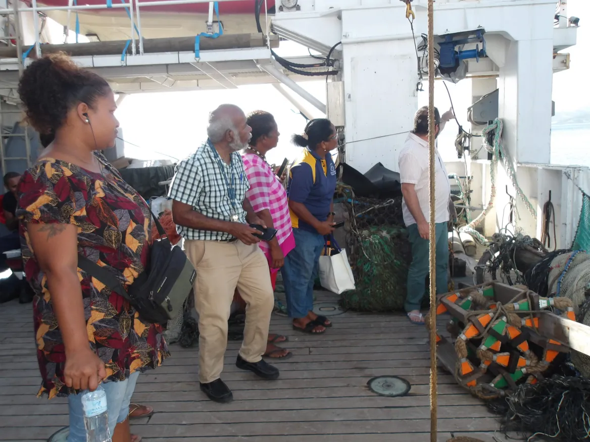{fig-align="center"}

Finally, we offered a glimpse into life at sea—showing the living quarters, mess hall, and the spaces that make weeks-long research campaigns both productive and (reasonably) comfortable.

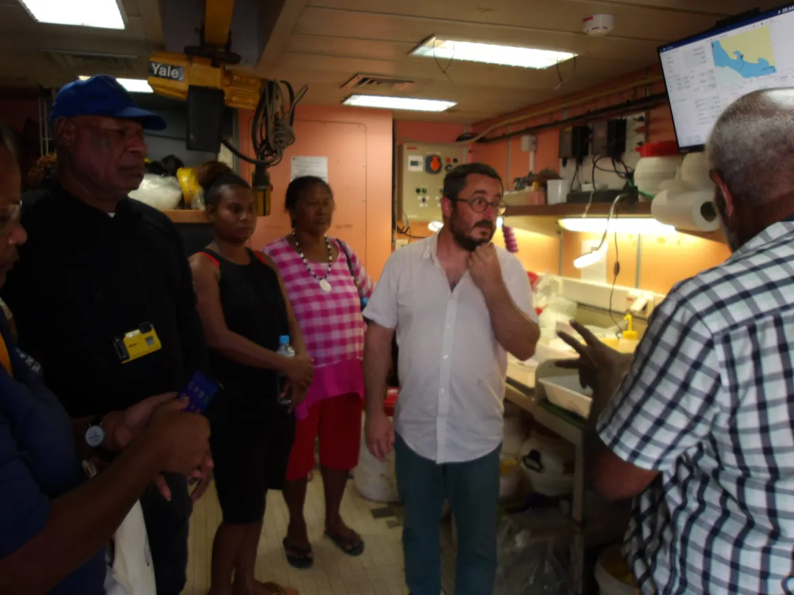{fig-align="center"}

The visit was a unique opportunity to open the doors of oceanographic research and share the realities of life and science at sea. For many of our guests, it was their first time aboard a research vessel—an experience we hope will inspire future collaborations and spark new scientific journeys in Papua New Guinea.

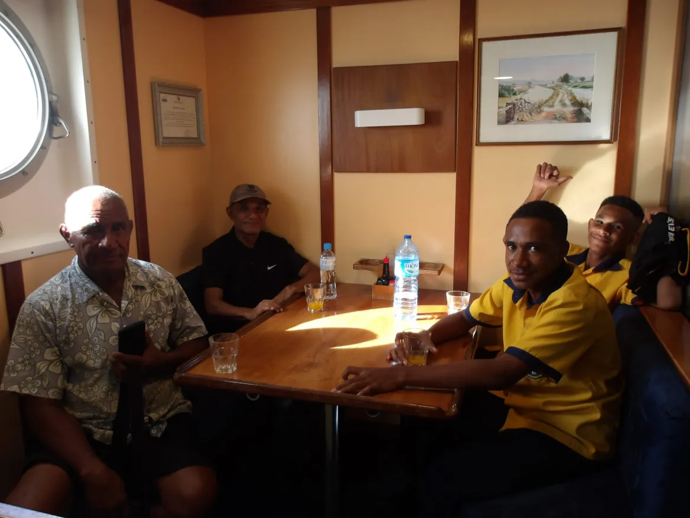{fig-align="center"}

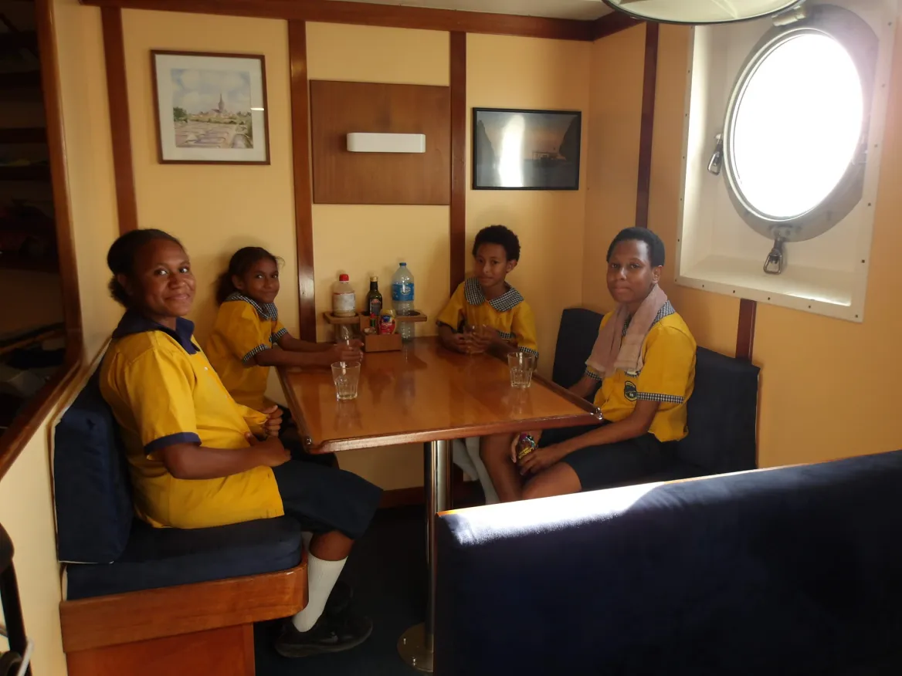{fig-align="center"}

This day of exchange underscored our commitment to collaborative science in Papua New Guinea. We are deeply grateful to UPNG and all participants for their warm welcome, thoughtful questions, and continued engagement. Events like these are vital to ensuring that the knowledge generated by oceanographic expeditions remains connected to the communities and institutions most closely linked to these remarkable ecosystems.
