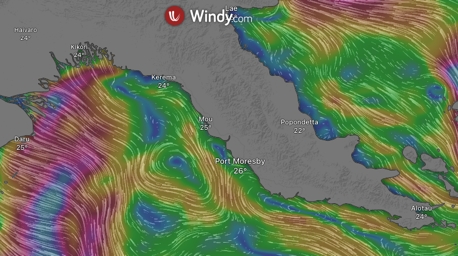
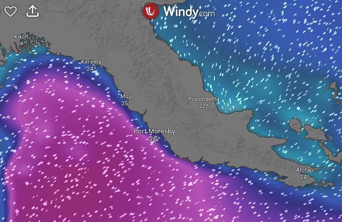
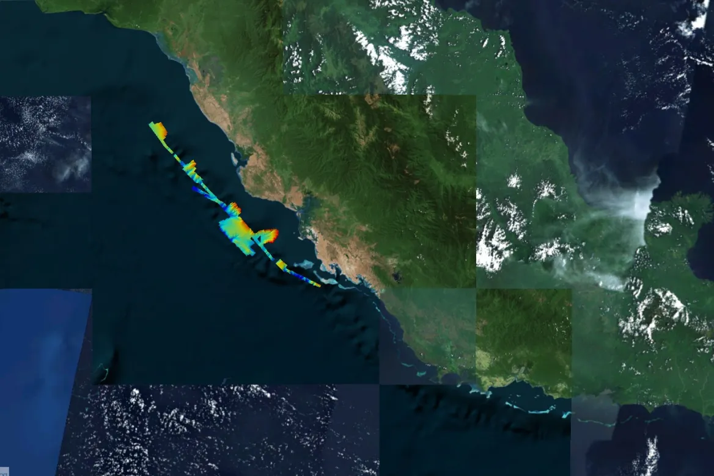
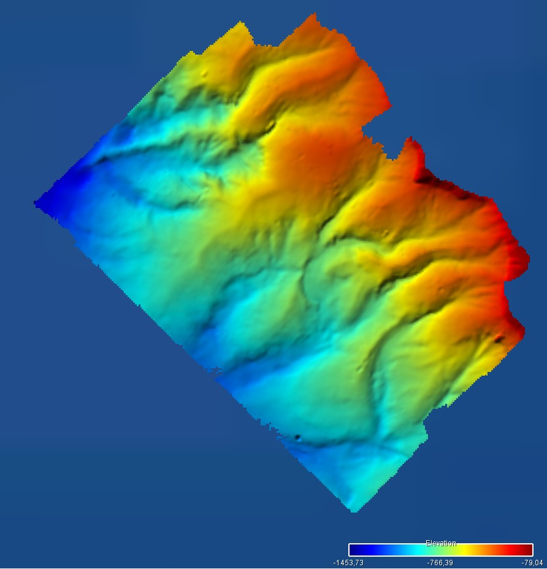
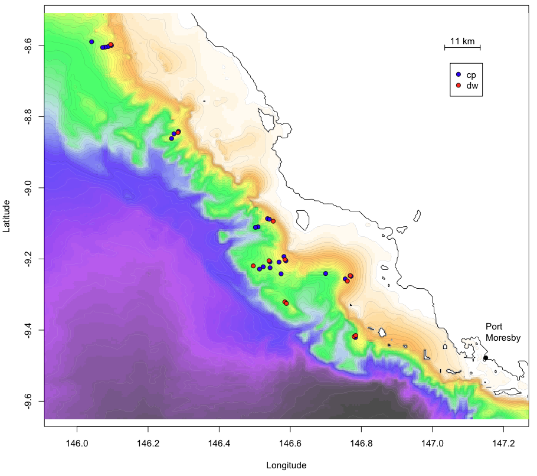

Our initial plan for the DAUNPAPUA cruise was to make a full loop around the Gulf of Papua, methodically sampling biodiversity along the way. But the ocean had other ideas. With strong swells and persistent winds sweeping through the region, we had to rethink our strategy. When waves grow too large, deploying our trawl nets and dredges becomes not only ineffective but dangerous. And when the wind and current move in different directions—as they often did—it becomes extremely difficult to maintain control of our fishing gear, especially while it’s operating on the seafloor (screenshots : currents on the top and swell on the bottom – source: Windy.col-m).

{fig-align="center"}

{fig-align="center"}

So we adapted. Instead of circling the gulf, we hugged the coastline, working our way from Port Moresby to Kerema. The terrain there is strikingly dramatic: steep underwater slopes plunging down to 3,000 meters. But beauty comes with challenges. The navigation charts in this area are notoriously sparse, and it’s not uncommon to suddenly find a sharp seamount rising up beneath the boat—even when charts indicate deep water. It’s happened on previous cruises, and we took no chances.

{fig-align="center"}

To identify safer working zones, we turned to global bathymetric data from [GEBCO](https://www.gebco.net/)—the General Bathymetric Chart of the Oceans, a global terrain model of the seafloor. Using this coarse but comprehensive data, we selected our initial target areas. We then mapped them ourselves using our ship’s multibeam echosounder, starting from the deep and moving upslope. This helped avoid any unexpected encounters with uncharted peaks. In fact, during one night of mapping, the vessel passed alarmingly close to a 12-meter-deep summit—right in the middle of what had seemed to be a 300-meter-deep slope.

Thanks to our high-resolution bathymetric maps (where each pixel represents about 450 meters), we’re now better able to “read” the underwater terrain and decide where best to deploy our sampling gear. As a general rule, we begin at higher elevations using the dredge—better suited to scraping over hard seafloor. As we move deeper and the sediment becomes finer, we switch to the trawl, which performs better on muddy bottoms.

{fig-align="center"}

In most parts of the Gulf of Papua, the seabed was indeed soft. Slopes, terraces, and submarine canyons were often blanketed in fine mud—ideal for our trawl net. But not everywhere. On one submerged bank, we came across rugged hard rock covered in a glinting polymetallic crust, and dotted with vibrant stylasterid and scleractinian corals. A completely different kind of habitat—and an exciting one.

{fig-align="center"}

I’ll tell you more about the animals we’ve encountered in another post. For now, we’re just glad to be safely navigating this wild and unpredictable seascape, one carefully mapped slope at a time.
