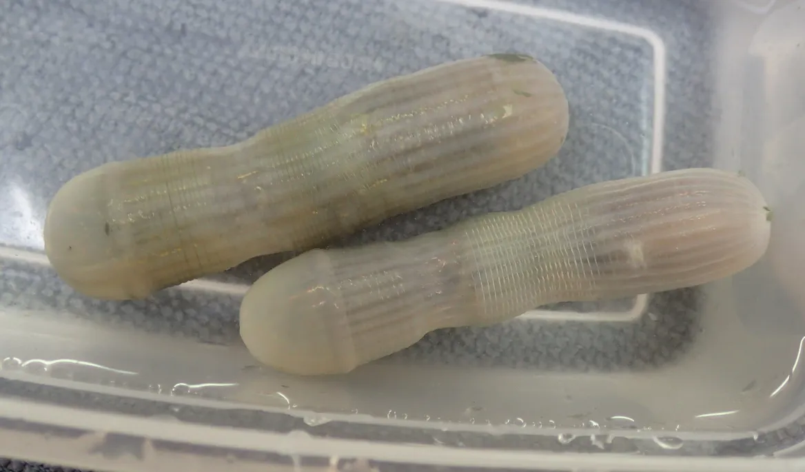

Priapulids represent one of the lesser-known branches of the tree of life, forming a distinct lineage within the Metazoa. Although vermiform in appearance, they are more closely related to arthropods (and thus to insects and crustaceans) than to annelids (Raeker et al., 2025). In terms of diversity, with only 22 known species, they constitute one of the most enigmatic phyla among bilaterally symmetrical animals.

{fig-align="center"}

Priapulids are well-represented in the fossil record. In the Cambrian period, they were among the most abundant groups of marine benthic animals (Vannier et al., 2010). Today, they are benthic organisms inhabiting sedimentary environments, ranging from the intertidal zone to depths of approximately 1,000 meters. The presence of prominent pharyngeal teeth suggests they are predators.

However, little is known about their ecology. Most of the available ecological data concern the Arctic species *Priapulus caudatus* (e.g., Kolbasova et al., 2023), which is found across a broad range of habitats—from the intertidal zone to the deep sea—and can tolerate low salinity, low oxygen levels, and high concentrations of hydrogen sulfide (H₂S).

Known species fall into two size categories: small (millimeter scale) and large (centimeter scale, with the largest reaching up to 40 cm). The nine known large species are found in temperate and cold waters, while the smaller species are primarily reported from tropical and subtropical environments (Schmidt-Rhaesa & Raeker, 2023).

Nonetheless, researchers participating in the Tropical Deep-Sea Benthos surveys have frequently encountered animals in their collections that likely belong to this phylum. During this first week of sampling, we collected several specimens that appear to be priapulids. These will complement earlier collections, which are still awaiting taxonomic description.

> Kolbasova, G., Schmidt-Rhaesa, A., Syomin, V., Bredikhin, D., Morozov, T., & Neretina, T. (2023). Cryptic species complex or an incomplete speciation? Phylogeographic analysis reveals an intricate Pleistocene history of *Priapulus caudatus* Lamarck, 1816. *Zoologischer Anzeiger*, 302, 113–130.
>
> Raeker, J., Lord, A., Herranz, M., Giribet, G., Worsaae, K., & Schmidt-Rhaesa, A. (2025). The big, the small and the weird: A phylogenomic analysis of extant Priapulida. *Molecular Phylogenetics and Evolution*, 108297.
>
> Schmidt-Rhaesa, A., & Raeker, J. (2023). Review of the Priapulida of New Zealand with the description of a new species. *New Zealand Journal of Zoology*, 1–35.
>
> Vannier, J., Calandra, I., Gaillard, C., & Żylińska, A. (2010). Priapulid worms: pioneer horizontal burrowers at the Precambrian-Cambrian boundary. *Geology*, 38(8), 711–714.

by: Sarah Samadi, MNHN
