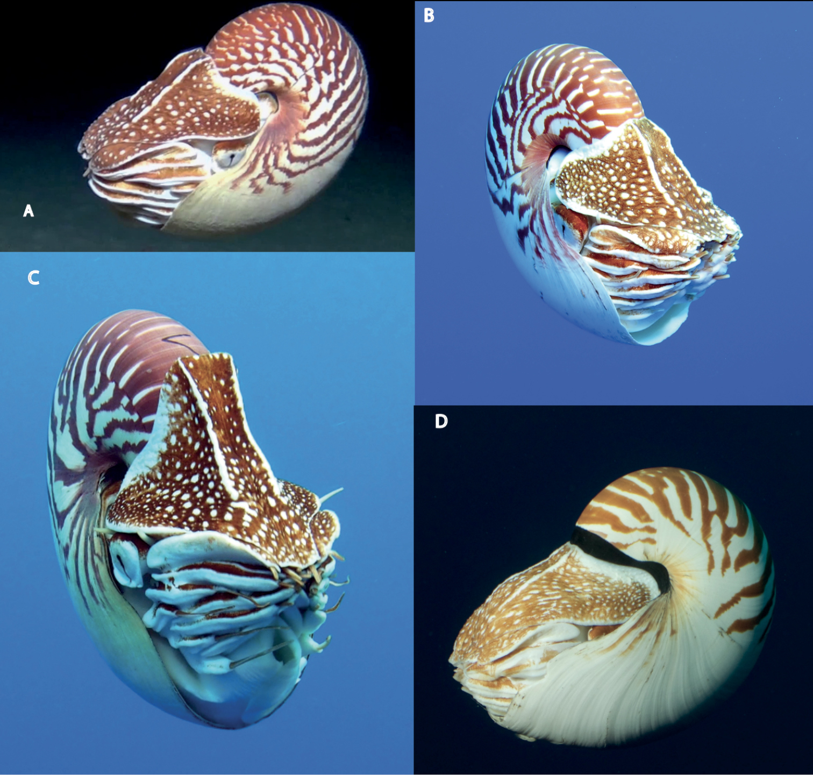
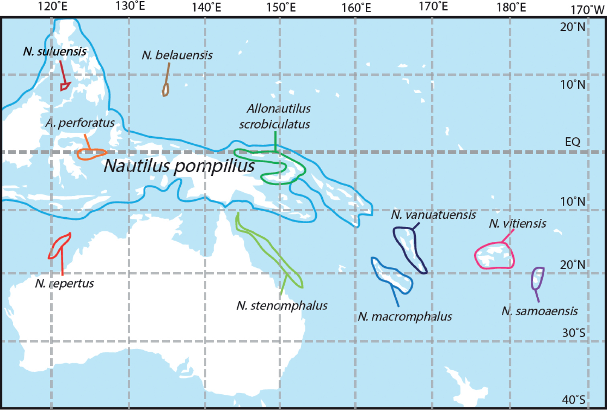
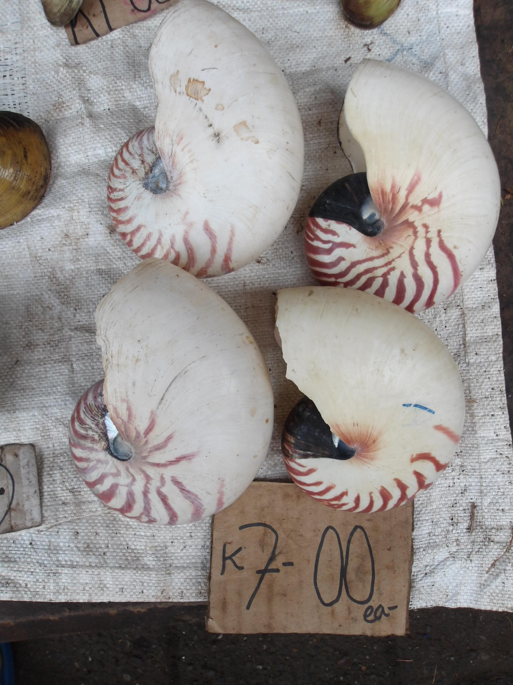
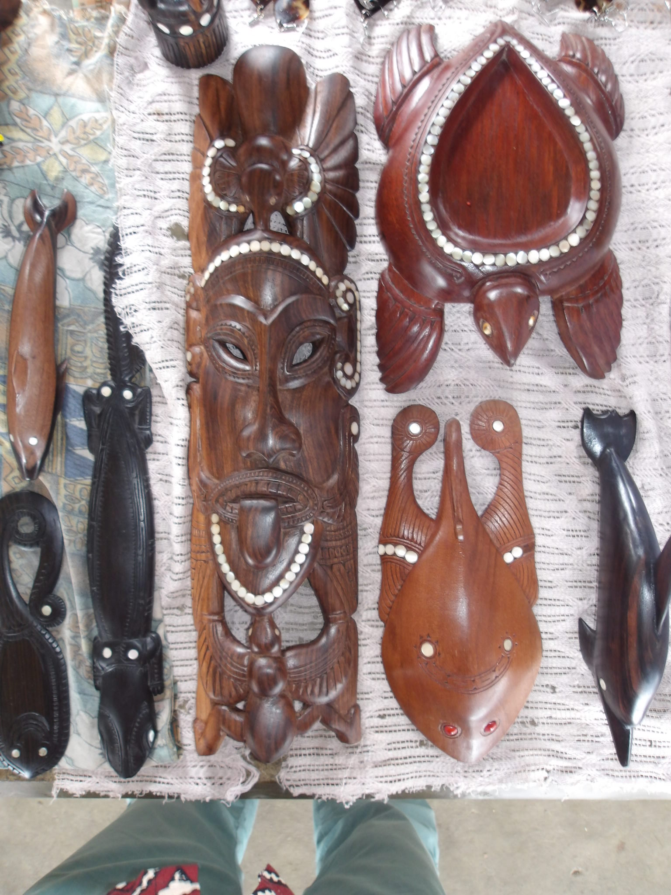

Towards the end of Leg 1, east of the Gulf of Papua, we had the privilege of catching some live *Nautilus*. These remarkable cephalopods are instantly recognizable by their beautiful, spiraled shells and the quiet grace with which they move through the water. Unlike other cephalopods like octopuses or squids, *Nautilus* retains an external shell and a unique set of physiological traits that set it apart within the mollusk world.

{fig-align="center"}

We placed the two specimens, safely retracted within their shells, into a large cooler filled with cold seawater, giving them time to recover from the stress of capture. For the first few hours, they stayed still and cautious. But eventually, they began to explore the cooler—gliding up and down, brushing their tentacles along the walls, and revealing their curious slit-like eyes.

That night on the ship, I dove into the available literature. According to recent studies, including a 2023 paper by Barord et al., *Nautilus* taxonomy relies on a combination of external shell features—such as shape, proportions, and pigmentation—as well as genetic data.

{fig-align="center"}

To contribute to ongoing efforts to resolve *Nautilus* diversity, we collected tissue samples for DNA. We gently pinched the tip of a tentacle from each specimen (they didn’t seem to mind) and carefully swabbed some epidermal cells with a cotton bud. We also took detailed photographs, following the protocol outlined in Barord et al. (2023).

> Barord GJ, Combosch DJ, Giribet G, Landman N, Lemer S, Veloso J, Ward PD (2023). Three new species of *Nautilus* Linnaeus, 1758 (Mollusca, Cephalopoda) from the Coral Sea and South Pacific. *ZooKeys* 1143: 51–69. https://doi.org/10.3897/zookeys.1143.84427

According to this study, our specimens are likely *Nautilus pompilius*, but recent taxonomic work has uncovered other distinct species within the Coral Triangle—species that had previously been overlooked due to subtle morphological differences. Once we had finished sampling and documentation, we gently released the two animals back into the sea.

Our encounters didn’t stop there. We recovered a few empty shells in our trawls across the Gulf of Papua—likely natural remains from deeper waters. Later, at the Alotau market, we saw more shells for sale. Local vendors explained that *Nautilus* shells are commonly collected from the shore, and the shimmering inner nacre is often used to decorate wood-carved animals and ornaments.

{fig-align="center"}

We took photographs of the market specimens as well. Once back on shore, we hope to analyze these using morphometric comparisons and shell pigmentation patterns to identify them more precisely.

{fig-align="center"}

Seeing *Nautilus* alive, moving slowly and deliberately through the water, was a quiet moment of wonder—reminding us of just how much diversity still lies beneath the surface, and how much remains to be understood and protected.
