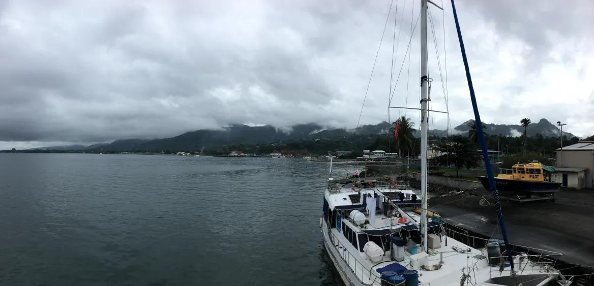
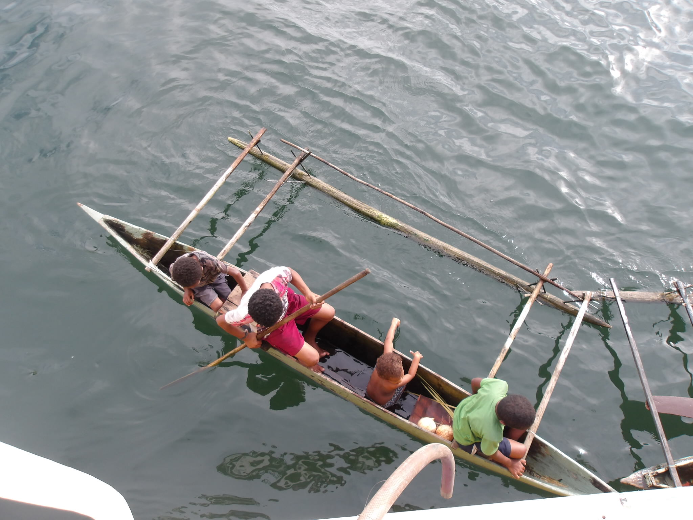
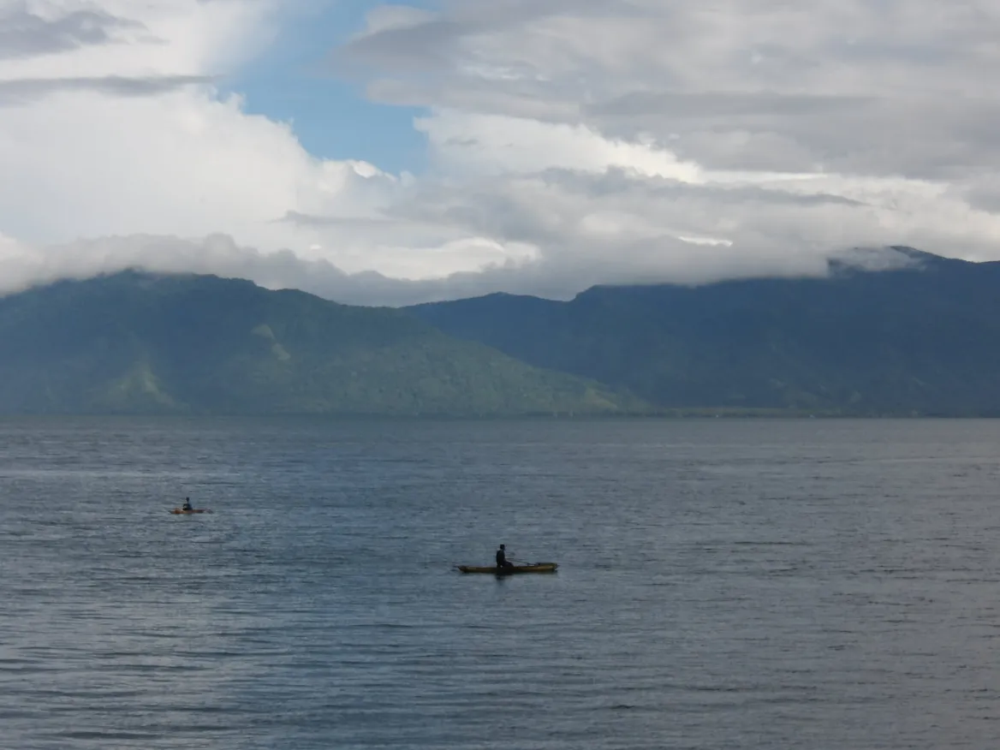

At the end of Leg 1, we entered Milne Bay and docked in Alotau on the morning of July 8th. The sky welcomed us with heavy tropical showers—intense, but brief, stopping as abruptly as they had begun. Soon after, the water around Antea began to ripple with the gentle approach of outrigger canoes. Children were slowly sculling toward our ship, their movements quiet but confident.

{fig-align="center"}

“Hello! Are you not at school?” I called out.

“No school today. It rains too much,” one answered.

“Are you fishing?”

“No.”

“What are you looking for?”

“Chocolate.”

The answer came quickly, with serious expressions and expectant eyes.

“You want some chocolate?” I asked, smiling.

“Yes,” they replied, a bit shyly at first.

As I kept speaking, more and more outrigger canoes clustered alongside Antea, until there were about a dozen kids, ranging in age from three to ten, all floating next to our big hull.

{fig-align="center"}

“All of you want chocolate?”

“Yes.”

“I can’t hear you!”

This time, the smiles began to spread—broad, contagious, joyful.

“YES!”

We arranged a little trade: a few bars of Papua New Guinea’s finest Queen Emma chocolate in exchange for four fresh coconuts. Then I asked a question I’d been dying to ask:

“Can I try your canoe?”

They looked puzzled.

“Will you come onboard with me and show me how well you paddle?”

“Yes!”

Carefully, I sat across the narrow hull—one butt cheek on each side of the outrigger. Laughter erupted. The kids couldn’t believe it. They took me on a little spin around the bay. From down in the water, Antea looked enormous.

And just like that, a rainy morning turned into one of those unexpected, heartwarming memories—where chocolate and coconuts were the only currency we needed.

{fig-align="center"}

{fig-align="center"}
