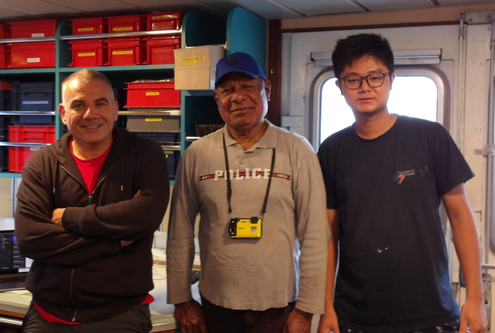

As the first leg of our expedition comes to a close, we bid farewell to two valued team members: Dero Wang, a PhD student at the Muséum national d’Histoire naturelle (MNHN) in Paris, and Claire Laguionie from CNAM Intechmer. Both have disembarked from ANTEA to return to their home institutions in France. Their contributions during the first phase of the cruise—from sample processing to station logistics—have been tremendous, and we thank them warmly!

{fig-align="center"}

Taking their place, we’re thrilled to welcome three new scientists on board:

- Ralph Mana, an ichthyologist from the University of Papua New Guinea in Port Moresby,
- Shing Lai (Terry) Ng, an ichthyologist from the Institute of Oceanography at National Taiwan University,
- and Stéphane Hourdez, an annelid taxonomist based at the Banyuls Marine Laboratory in France.

Each brings a wealth of experience and expertise that will enrich the second leg of our expedition—from deep-sea fish to polychaetes and beyond.

Welcome aboard, Ralph, Terry, and Stéphane! We’re excited for the journey ahead.

------------------------------------------------------------------------

Original WordPress post: <https://epante.wordpress.com/2025/07/10/crew-changes-and-new-faces-on-board/>
