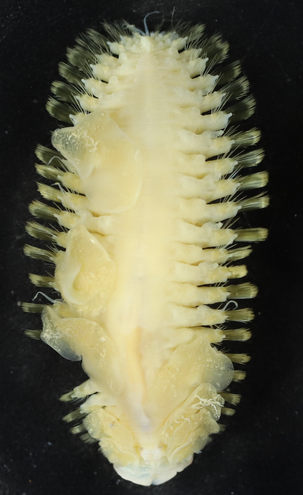
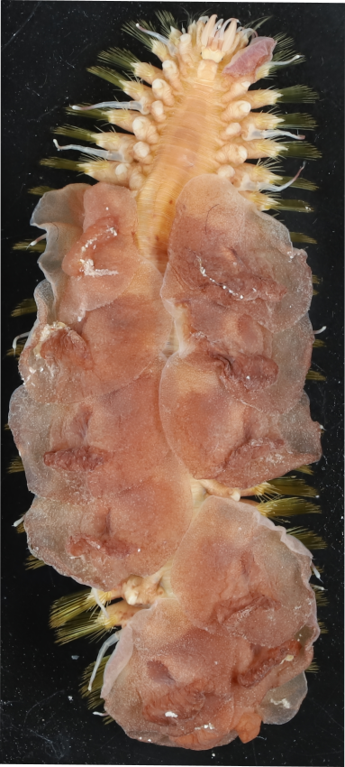
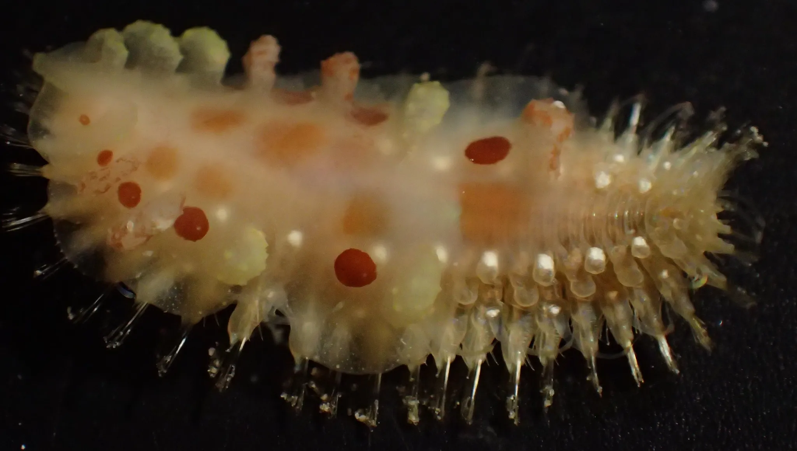

Hi! My name is Brice Morhain, I am a PhD student at Muséum National d’Histoire Naturelle in Paris and I am supervised by Sarah Samadi and Stéphane Hourdez who also embark on the DAUNPAPUA cruise. I study Polynoidae, a family of marin annelids that display scales on their back. This family contains a large number of ecologically very diverse species.

We find Polynoidae in every ocean, at every depth and in every benthic environment, ranging from the coast to the trenches, including abyssal plains or hydrothermal vents. They live freely or forming associations with other animals like corals, sponges, mussels …

{fig-align="center"}

Thus Polynoidae can be used as model to study adaptive response to the environmental constraints of life in oceans. The first step before identifying the adaptations of different lineages to different environment is to trace back evolutionary history of the whole family by reconstructing a large scale phylogeny.

One potentially example of key adaptation to hydrothermal environments that has been highlighted is the presence of tetra-domain hemoglobin only in the subfamily of Branchinotoglumininae that live in those chemo-synthetic environments. This type of globin allows better capture of oxygen in hypoxic environments.

{fig-align="center"}

DAUNPAPUA is my first oceanographic cruise. I am very excited to live this at-sea experience, to see the marine diversity of this part of the world and to catch my first Polynoidae!

{fig-align="center"}
