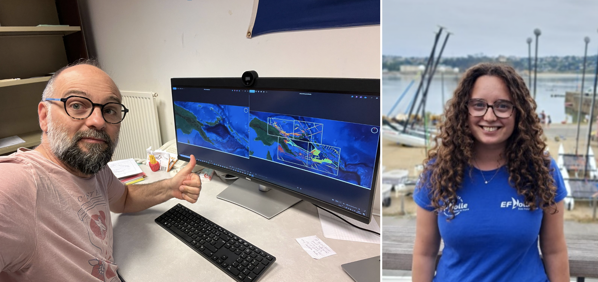
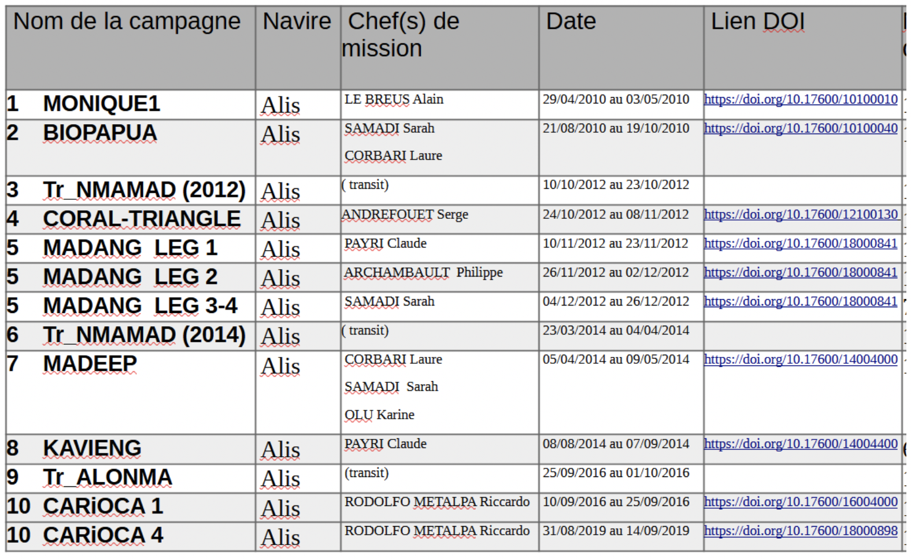
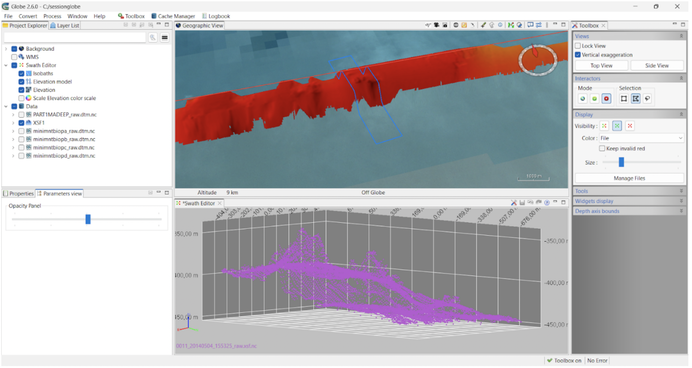
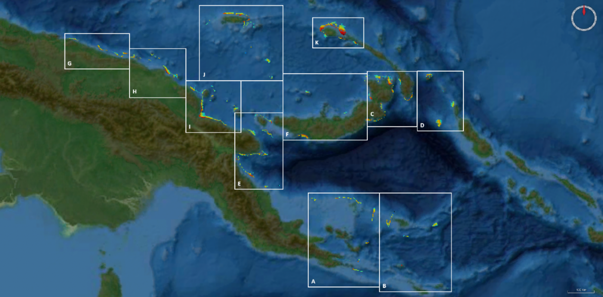
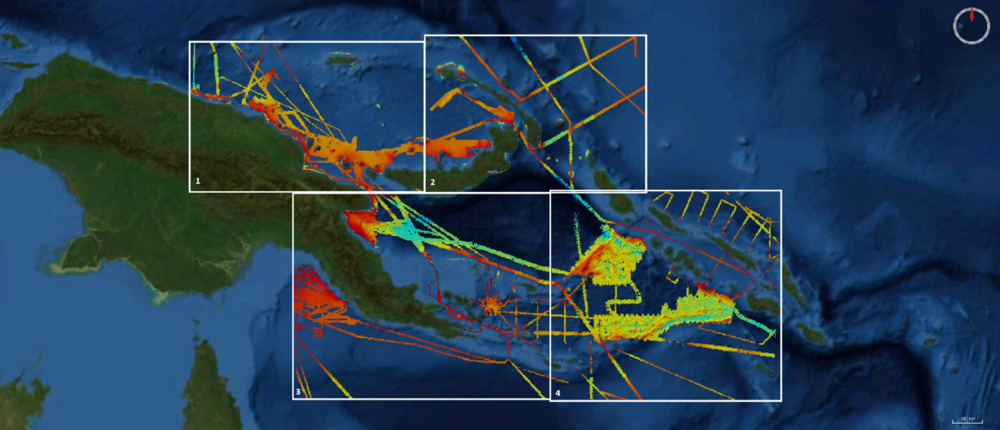

While leg 1 of the DAUNPAPUA scientific cruise is in full swing collecting deep-sea samples in the Gulf of Papua, we geologists from the Université de Bretagne Occidentale and Ifremer of the lab UMR Géo Océan in Brest are preparing bathymetric maps for leg 2!

{fig-align="center"}

The seabed in the Gulf of Papua is essentially composed of soft seafloor muds, whereas the seafloor explored during leg 2 are more likely to be made up of hard substrates. This particularity of leg 2 increases the chances that sampling gears will be damaged and possibly lost on the seabed. In order to limit such breakage, it is useful to have the best possible bathymetric maps, in order to target sampling sites on areas with little roughness and flat reliefs.

Our work, conducted within the frame of an L3 Earth Science internship at UBO (Louise Fabien), involved gathering the available data, cleaning and processing it to produce bathymetric grids (DTMs) to be displayed on the bridge deck.

The data inventory gathered:

- all data collected by R/V Alis and its EM1002 multibeam echosounder in the PNG region.
- a compilation of data extracted from NOAA’s website over the area.

The RV Alis data comes from the Biopapua (2010), Carioca (2016-2019), Coral-Triangle (2012), Kavieng (2014), Madang (2012), Madeep (2014), Monique-1 campaigns and the Tr_ALONMA, Tr_NMAMAD (2012), Tr_NMAMAD (2014) transits. Because these data were not available on the SISMER website, we accessed them thanks to Jeff Barazer, former captain of RV Alis. Once the sorting and indexing the data completed, they were send to SISMER for archiving.

{fig-align="center"}

Data processing and cleaning were carried out using the freeware Globe developed by the French Oceanographic Fleet.

{fig-align="center"}

25 m resolution grids were produced using multibeam data from RV Alis and the data downloaded from NOAA allowed producing 100 m resolution grids, that were completed with the Alis data downscaled at 100 m resolution.

{fig-align="center"}

{fig-align="center"}

This work was achieved using softwares Globe, QGIS and ArcGIS.

by: J. Collot, L. Fabien, B. Loubrieu (UBO, France)
