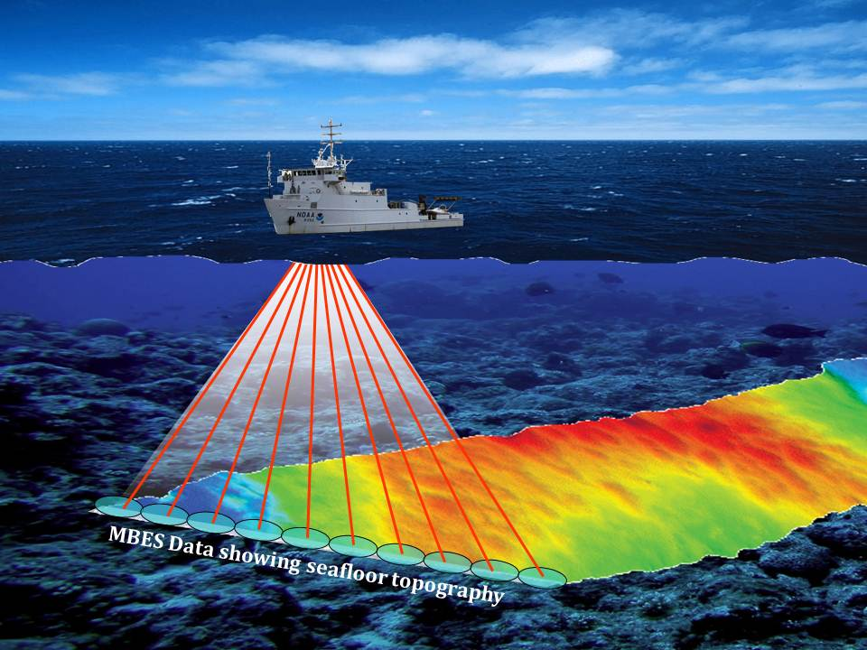
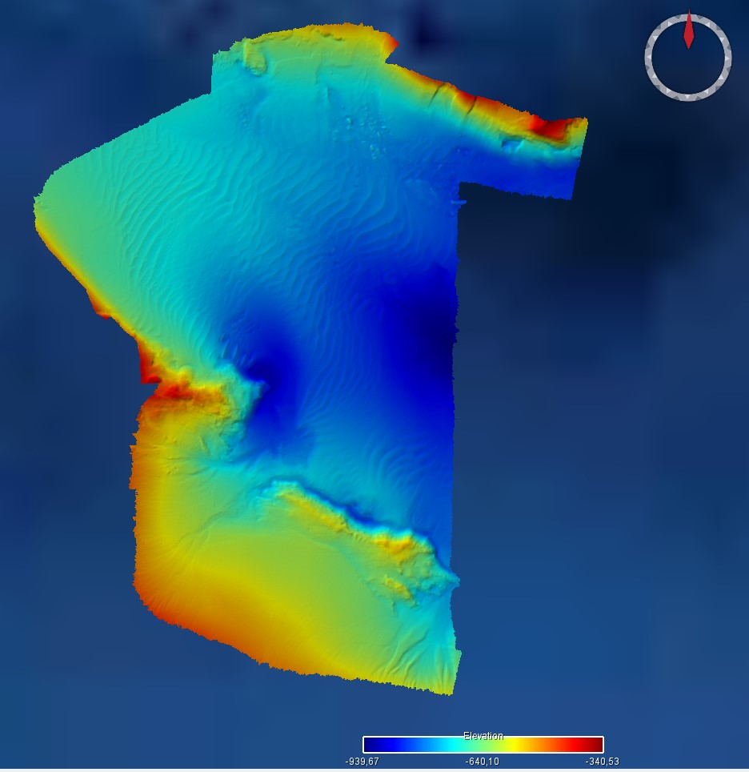
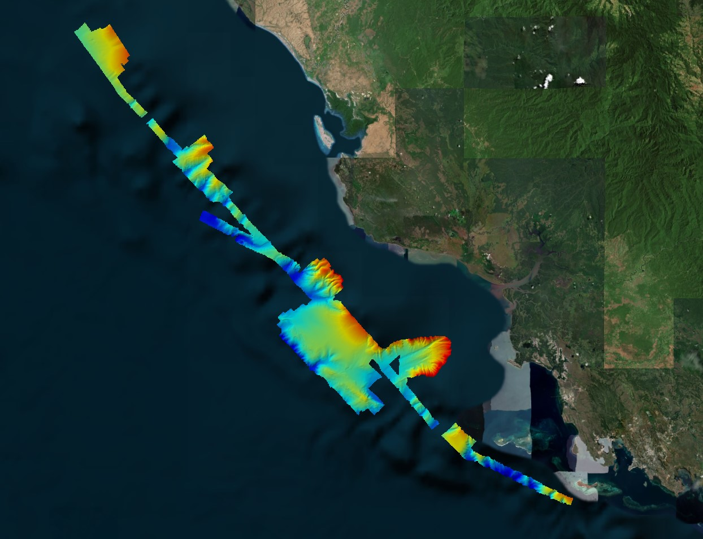

While geologists from the University of Brest (France) compiled existing bathymetric data for Papua New Guinea, much of the region remains unmapped in high resolution. That’s why, during the DAUNPAPUA expedition, we’ve been actively completing the picture with our own seafloor mapping efforts.

Our research vessel, NO Antea, is equipped with a Kongsberg EM 712 multibeam echosounder. This high-resolution sonar system is designed for mapping seafloors down to 3600 meters and can operate at frequencies between 40 and 100 kHz. Onboard, it allows us to produce seafloor maps where each data point—each “pixel”—covers approximately 37 square meters at 1000 meters depth.

{fig-align="center"}

In poorly mapped areas, our nightly routine begins with bathymetric surveys. We define survey zones based on nautical charts and global bathymetric models such as GEBCO (General Bathymetric Chart of the Oceans). We specifically look for areas between 100 and 1000 meters deep, with relatively gentle slopes, so we can safely deploy bottom-sampling gear like dredges and trawls.

{fig-align="center"}

The size of each surveyed “box” varies by location but typically covers around 20 square kilometers. We run systematic transects back and forth across the area, ensuring at least 25% overlap between swaths for optimal data quality and coverage.

By morning, our onboard electronics team conducts a thorough quality check of the data. Then, between 6:30 and 7:00 a.m., we meet with the captain to finalize the day’s sampling plan, based on the map we generated overnight. We usually begin sampling in shallower depths and move deeper throughout the day. Operations typically start with a dredge, which can tolerate rougher or rockier seafloors, and if the substrate appears soft (mud or sand), we then switch to the trawl.

These bathymetric maps have become a central tool in our sampling strategy. They not only help us target suitable habitats but also protect our gear—preventing costly damage or loss on rugged or poorly known seabeds.

by: J. Collot, L. Fabien, B. Loubrieu (UBO, France)
