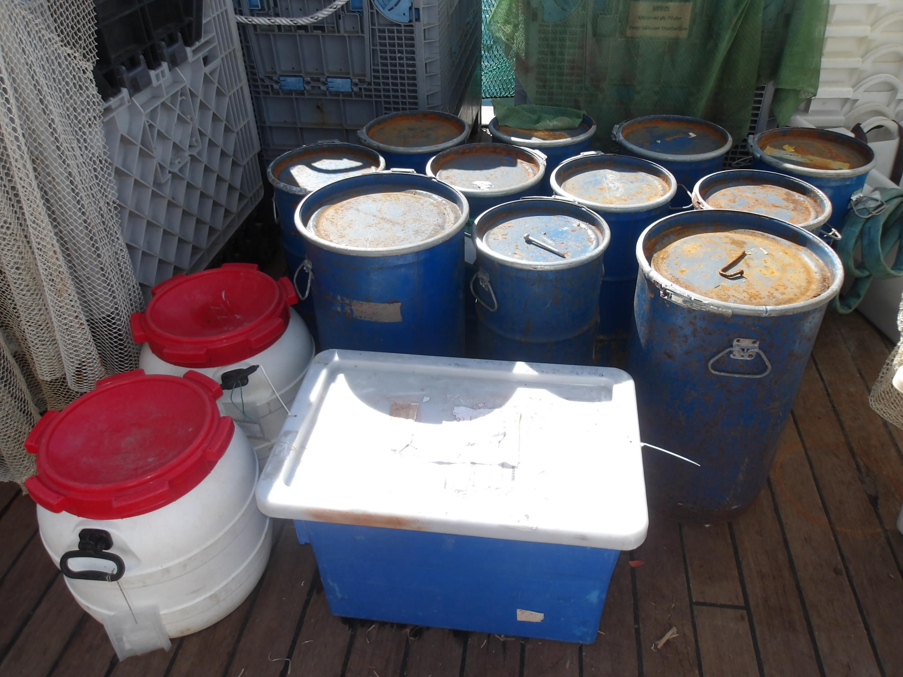
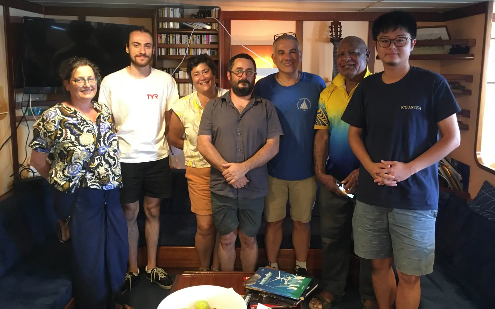

After two productive days working in Milne Bay, our team found a promising new site northwest of Normanby Island, sheltered in the lee of the d’Entrecasteaux Archipelago. We were off to a solid start, beginning operations as usual at 7 a.m. But just after the first dredge was hauled back on deck, our plans were upended.

The captain called an emergency meeting to inform us of a serious structural issue. That morning, one of the mechanics had noticed water pooling on the floor of the starboard engine room. Upon closer inspection, the team discovered three cracks in the hull. The verdict was clear: we had to head back to Alotau immediately.

We arrived the next morning, and on July 16th, the news came in—repairs would be long and complex. The DAUNPAPUA expedition was officially cut short. In total, we lost 16 days at sea. It’s a frustrating way to end an expedition, but the most important thing is that everyone is safe and sound.

Despite the abrupt end, our time at sea was incredibly productive. During our 18 days on the water, we visited 69 sites, spent over 150 hours mapping the seafloor, and conducted extensive biological sampling.

- On Leg 1, we collected over 600 fish specimens, representing approximately 170 species.
- Leg 2 was off to an equally strong start, with 400 fish specimens from about 100 species.
- We gathered over 1,200 lots of mollusks, 480 sea cucumbers, 400+ annelids, and around 470 crustaceans—a remarkable haul for such a short window of time.

{fig-align="center"}

We may be returning to shore earlier than planned, but certainly not empty-handed. Our samples will keep taxonomists and researchers busy for months. And who knows—once the boat is repaired, maybe we’ll be back for a second round.

