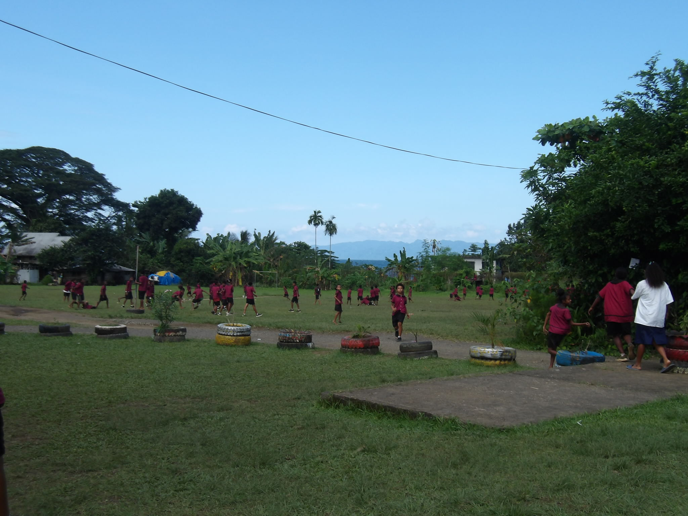
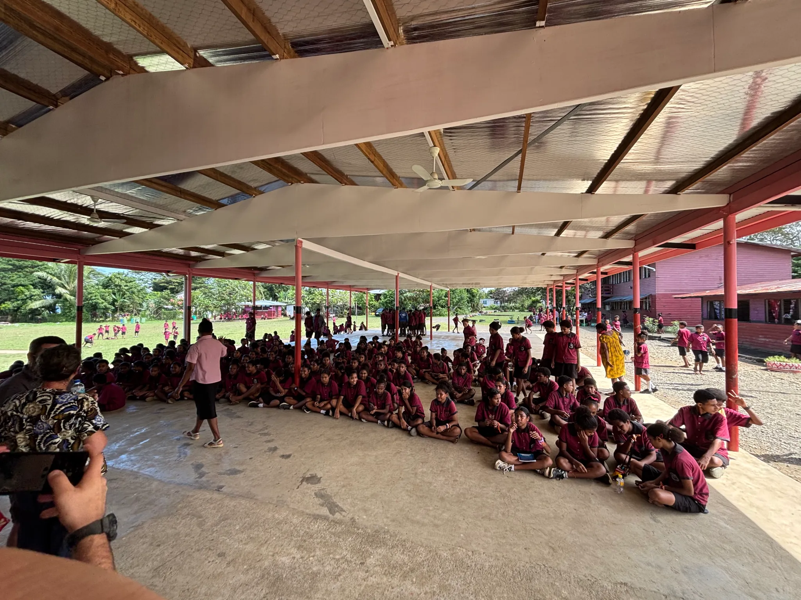
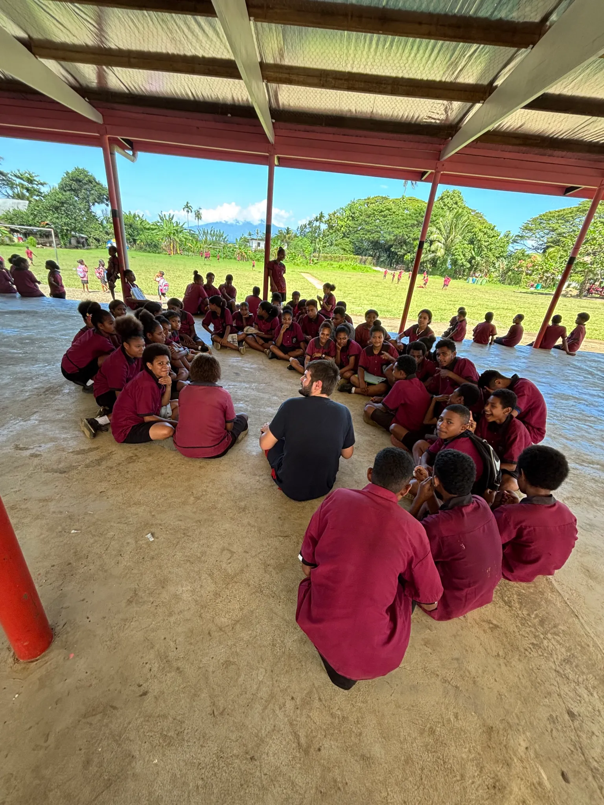
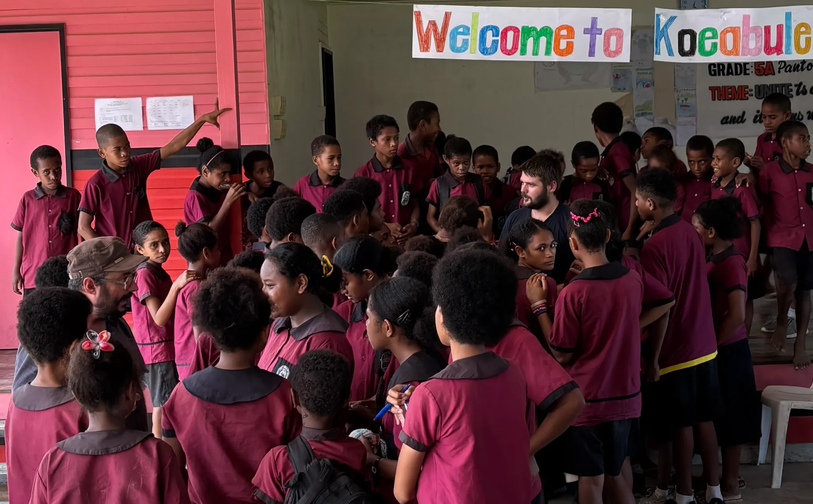

While waiting for updates on the status of our vessel (see “An Unexpected End to DAUNPAPUA at Sea”, published July 20, 2025), we took the opportunity to connect with the local community on land.

With support from the Milne Bay Provincial Government, we arranged a school visit—and on Friday, July 19th, five members of the DAUNPAPUA team visited Koeabule Primary School, perched on a hillside overlooking the sea on the western edge of Alotau.

{fig-align="center"}

{fig-align="center"}

The school hosts around 1,400 students, and we had the pleasure of meeting 286 bright and curious Grade 5 and 6 students.

Our outreach crew included:

- Sarah (co-chief scientist),
- Ralph and Terry (our resident ichthyologists),
- Harvald (Lieutenant aboard ANTEA),
- and myself.

After a short collective introduction, we split the students into 15 groups of about 20, rotating through stations where we explored the mysteries of the deep sea. We tackled questions like:

- How deep is the ocean?
- How do we map the seafloor?
- What animals live in the abyss?
- And what is it really like to live on a ship for weeks on end?

Each of us brought our own specialty to the table:

- Ralph and Terry dove into fish diversity,
- Sarah spoke about ocean exploration,
- I introduced them to deep-sea corals and lifeforms,
- and Harvald offered a glimpse into life aboard the ANTEA.

We were genuinely impressed by the students’ existing knowledge of marine life—some asked us about giant squids, scuba diving, and even the Mariana Trench!

It was a joyful, humbling experience to share our passion with the next generation of ocean lovers. We had a great time—and judging by the sea of smiles and eager questions, the kids did too.
