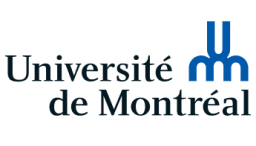
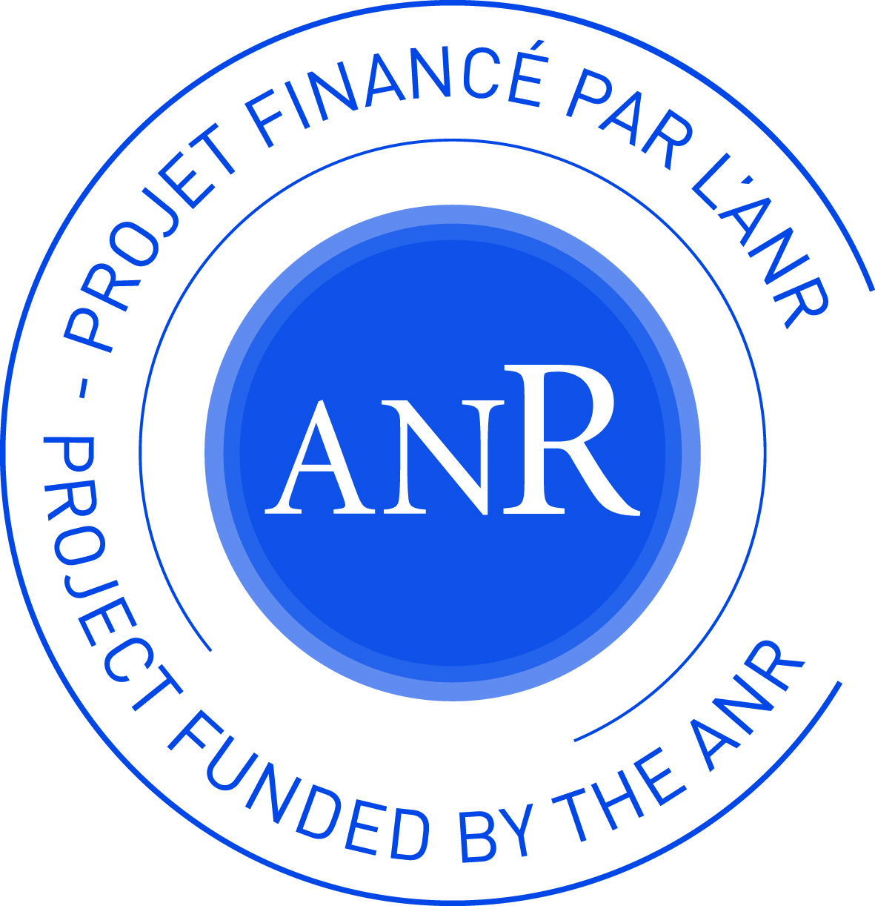
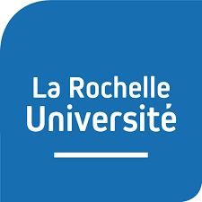
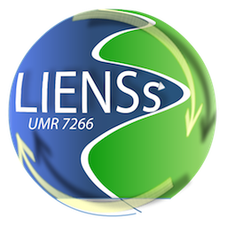

# Study of Doubly Uniparental Inheritance (DUI) of mitochondria and its role in maintaining reproductive isolation in bivalves

{fig-align="center" width="150"}

## **Context and Objectives**

Mito-nuclear genetic incompatibilities (MNI) have recently gained recognition as an important cause of hybrid breakdown and reproductive isolation. The study of these interactions has a lot of bearing on understanding genetic divergence and speciation. The remarkable system of doubly uniparental inheritance (DUI) of bivalves offer the opportunity of investigate the role of MNI in maintaining reproductive isolation in a highly diverse, ecologically and economically important group that is characterized by large population sizes, high fecundity and high dispersal abilities, factors that should impede the establishment of local adaptation. Project DRIVE will investigate the implications of MNI in population of the Baltic tellin, a littoral species that is characterized by DUI and multiple secondary contact zones conducive to MNI, and is affected by warming sea surface temperatures.

{fig-align="center" width="700"}

## **Why it’s important**

DRIVE touches on several key questions in organismal and evolutionary biology, such as how highly dispersive organisms such as marine bivalves can develop and maintain local adaptations at narrow geographical scales. Theory predicts that genetic incompatibilities causing population divergence can be trapped by environmental gradients, complicating tremendously the distinction between intrinsic and extrinsic barriers to gene flow. DRIVE will add a new tool to comprehend how these different forces can participate in population divergence. These questions have bearing for biodiversity research (the Bivalvia is a highly diverse group of over 9000 described species), as population divergence can lead to speciation, but also for aquaculture, as the adaptation of shellfish species to a changing environment is a strong societal and economic concern.

## Team

Below are listed participants during the course of the project (2019-2022) and their role in the project.

| Last Name | First Name | Affiliation |
|----------------------|------------------------|--------------------------|
| PANTE | Eric | CNRS Researcher, LEMAR lab, Coordinator |
| DUBILLOT | Emmanuel | CNRS assistant engineer, LIENSs lab |
| BECQUET | Vanessa | CNRS research engineer, LIENSs lab |
| HUET | Valérie | CNRS assistant research engineer, LIENSs lab |
| VIRICEL | Amélia | Assistant Professor, University of Brest, LIENSs lab |
| BRETON | Sophie | Associate Professor, University of Montreal, Canada |
| LE CAM | Sabrina | Post-doctoral researcher (2020-2022), LIENSs lab |
| MALKOCS | Tamas | Erasmus+ doc. intern (2020) University of Debrecen, Hungary |
| CREACH | Yuna | Master student (2023),  University of Brest (M1) |
| GRASSIN | Elzéar | Master student (2023),  University of Brest (M1) |
| KRECKELBERG | Eugénie | Master student (2022), Université Aix-Marseille (M2) |
| WATTEAU | Valentine | Master student (2021), Université Aix-Marseille (M2) |
| GRACIET | Arthur | Undergraduate student (2021), IUT La Rochelle |
| TASSE | Mélanie | Master student (2019-2021), University of Montreal, Canada |
| BREMAUD | Julie | Master student (2018-2019), Université de Bordeaux (M1+M2) |
| DUCOS | Salomé | Master student (2019), Université de Bordeaux (M2) |
| LAPEGUE | Marie | Licence student (2020), La Rochelle Université |
| PAGEAULT | Justine | Technician (2019), LIENSs lab |
| GHEDAMSI | Aya | BTS, Lycée Valin, La Rochelle, 2019 internships |

## Publications

You can find all the associated data and metadata (eg repository links for data and code, abstract, full citation, bibtex entry, preprint ...) in the **Publication** section of this website).

Le Cam S, Brémaud J, Becquet V, Garcia P, Viricel A, Breton S, Pante E (**2025**)[ Discordant population structure inferred from male- and female-type mtDNAs from *Limecola balthica*, a bivalve species characterized by doubly uniparental inheritance of mitochondria.](https://peercommunityjournal.org/item/10.24072/pcjournal.529.pdf) *Peer Community Journal*, *5*. doi:10.24072/pcjournal.529

Le Cam S, Brémaud J, Malkocs T, Kreckelbergh E, Becquet V, Dubillot E, Garcia V, Breton S, Pante E (**2023**) [Loop-mediated isothermal amplification-based molecular sexing in a gonochoric marine bivalve (Macoma balthica rubra) with divergent sex-specific mitochondrial genomes](https://onlinelibrary.wiley.com/doi/10.1002/ece3.10320). Ecology and Evolution 13(8) e10320. doi: 10.1002/ece3.10320. 

Tassé M , Choquette T , Angers A, Stewart DT, Pante E, Breton S (**2022**) [The longest mitochondrial protein in metazoans is encoded by the male-transmitted mitogenome of the bivalve *Scrobicularia plana*](https://royalsocietypublishing.org/doi/10.1098/rsbl.2022.0122). Biology Letters 18:20220122. doi: 10.1098/rsbl.2022.0122

Capt C, Bouvet K, Guerra D, Robicheau BM, Stewart DT, Pante E, S Breton (**2020**) [Unorthodox features in two venerid bivalves with doubly uniparental inheritance of mitochondria](https://www.nature.com/articles/s41598-020-57975-y). Scientific Reports 10 (1087), 1-13. doi:10.1038/s41598-020-57975-y 

Stewart DT, Breton S, Chase EE, Robicheau BM, Bettinazzi S, Pante E, Youssef N, Garrido-Ramos MA (**2020**) [An unusual evolutionary strategy: the origins, genetic repertoire, and implications of doubly uniparental inheritance of mitochondrial DNA in bivalves](https://hal.archives-ouvertes.fr/hal-02927307). 24th Evolutionary Biology Meeting at Marseilles – book chapter

## Presentations

[3rd Joint Congres on Evolutionary Biology, Montréal, Canada](https://www.evolutionmeetings.org/) (2024). Le Cam S, Malkocs T, Viricel A, Bidault A, Salin K, Breton S, Blier P, Pante, E. Does Doubly Uniparental Inheritance Of Mitochondria Play A Role In The Genetic Structure And Fitness Of The Marine Bivalve *Macoma balthica*? (poster, Le Cam)

[7th International conference on Marine Connectivity](https://www.sea-unicorn.com/post/7th-international-conference-on-marine-connectivity-advancing-research-for-improved-management) (iMarco), Montpellier, France (2024). Le Cam S, Malkocs T, Viricel A, Bidault A, Salin K, Breton S, Blier P, Pante, E. Insights on the potential role of doubly uniparental inheritance of mitochondria in genetic structure and fitness of the marine bivalve *Macoma balthica*. (poster, Pante)

[Society for Experimental Biology Annual Conference, Montpellier](https://www.sebiology.org/events/ems-past-event/2022-events/seb-annual-conference-2022.html), France (2022). Tassé M, Choquette T, Angers A, Pante E, Breton S —Mitochondrial plasticity and adaptation: proximate determinants and ultimate consequences for adjustments to environmental conditions. (talk, Tassé)

[6th International Marine Connectivity Conference (iMarCo)](http://www.6imarco.fr/), Paris, France (2021).Le Cam S, Bremaud J, Becquet V, Garcia P, Viricel A, Pante E — Genetic connectivity inferred from male- and female-type mitochondrial DNA from *Limecola balthica*, a bivalve species characterised by DUI. (talk, Le Cam)

[6th International Marine Connectivity Conference (iMarCo](http://www.6imarco.fr/)), Paris, France (2021). Pante E, Watteau V, Le Cam S — Mito-nuclear coadaptation in bivalves with doubly uniparental inheritance of mitochondria may rely on alternative splicing. (poster, Le Cam})

[17th Congress of the European Society for Evolutionary Biology](https://eseb.org/wp-content/uploads/2019/09/ESEB2019_Program.pdf) (ESEB), Turku, Finland (2019) Tassé M, Capt C, Pante E, Breton S. [The mtDNA-encoded COX2 protein: bivalves have the longest](https://app.oxfordabstracts.com/events/653/program-app/submission/122621) (poster)

[17th Congress of the European Society for Evolutionary Biology](https://eseb.org/wp-content/uploads/2019/09/ESEB2019_Program.pdf) (ESEB), Turku, Finland (2019) Bremaud J, Viricel A, Dubillot E, Pante E. [Comparative phylogeography of a marine bivalve based on males- and females-type mitochondrial DNA](https://app.oxfordabstracts.com/events/653/program-app/submission/123231) (poster)

## **Related publications**

Pante E, Becquet V, Viricel A, Garcia P (**2019**)[ Investigation of the molecular signatures of selection on ATP synthase genes in the marine bivalve *Limecola balthica*](https://www.alr-journal.org/articles/alr/abs/2019/01/alr180007/alr180007.html). Aquatic Living Resources 32(3): 7p (proceedings of PhysioMar17) doi:10.1051/alr/2019001

Pante E, Poitrimol C, Saunier A, Becquet V, Garcia P (**2017**) [Putative sex-linked heteroplasmy in the tellinid bivalve Limecola balthica (Linnaeus, 1758)](http://mollus.oxfordjournals.org/content/early/2016/12/29/mollus.eyw038.full?keytype=ref&ijkey=TCMIb8wdC0QxDoG). Journal of Molluscan Studies 83(1):226–228. doi:/10.1093/mollus/eyw038

## **Related links**

FRONTIERS IN RESEARCH TOPIC : [**EVOLUTION OF MITOCHONDRIAL GENOMES**](https://www.frontiersin.org/research-topics/9590/evolution-of-mitochondrial-genomes#overview)

## Funding

DRIVE is a JCJC (Jeunes Chercheurs, Jeunes Chercheuses) project funded by the French Research Agency ([ANR-18-CE02-0004](https://anr.fr/Projet-ANR-18-CE02-0004)).

::: {layout-nrow="2" layout="[[1,1], [1,1,1,1]]"}
{width="200"} {width="200"}

{width="100"} {width="100"} {width="100"} {width="100"}
:::
