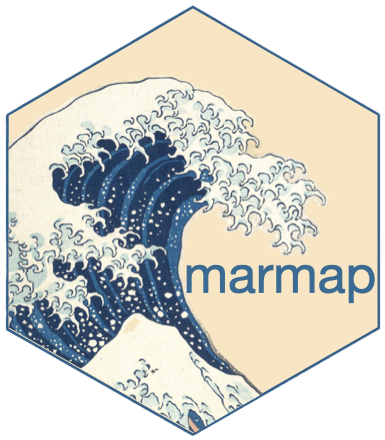

```{r setup, include = FALSE}
library(knitr)
library(cranlogs)
library(tidyverse)
library(plotly)
library(sf)
library(leaflet)
library(rnaturalearth)
source("~/Documents/GitHub/ericpante.github.io/seadog/projects/marmap_data/r/openalex_api.R")
source("~/Documents/GitHub/ericpante.github.io/seadog/projects/marmap_data/r/github_analysis.R")
source("~/Documents/GitHub/ericpante.github.io/seadog/projects/marmap_data/r/stack_overflow_api.R")
source("~/Documents/GitHub/ericpante.github.io/seadog/projects/marmap_data/r/leaflet.r")
source("~/Documents/GitHub/ericpante.github.io/seadog/projects/marmap_data/r/ecosystem.R")
```

#  {.sidebar}

{fig-align="center"}

This dashboard analyses the statistics and broad community impact of `marmap`. The data are retrieved through the `OpenAlex` (for citations), `github` (for code metrics) and `Stack Exchange` (for community interactions) APIs. The data is analysed in `R` and displayed with `Quarto`. The code is open source and accessible here.

# citations

## Row

```{r}
#| content: valuebox
#| title: "Last update"
list(
  icon = "calendar-check",
  color = "primary",
  value = today()
)
```

```{r}
#| content: valuebox
#| title: "Number of citations"
list(
  icon = "journal-text",
  color = "primary",
  value = n.citations
)
```

```{r}
#| content: valuebox
#| title: "Number of authors"
list(
  icon = "people",
  color = "primary",
  value = n.authors
)
```

```{r}
#| content: valuebox
#| title: "% Open Access"
list(
  icon = "unlock",
  color = "primary",
  value = round(percent.oa, 1)
)
```

## row

```{r}
#| title: "citations per year"
ggplotly(gg.marmap)
```

```{r}
#| title: "keyword cloud (n≥10)"
marmap_keywords %>% wordcloud2(minSize=10)
```

# topics

```{r}
#| title: "openalex topics associated with citations"
ggplotly(topics, tooltip = "text")
```

# map

```{r}
#| label: map
#| title: "map of authors citing marmap"

# Colour palette
pal <- colorNumeric(
  palette = viridis(256),
  domain = polygons$n
)

# map
leaflet(polygons) %>%
  addTiles() %>%
  setView(0, 0, 1.5) %>%
  addPolygons(
    fillColor = ~pal(n),
    color = "white",
    weight = 1,
    fillOpacity = 0.7,
    label = ~paste0(iso_a2_eh, ": ", n)
  ) %>%
  addLegend(
    pal = pal,
    values = ~n,
    title = "author count"
  )


```

# types 

## row

```{r}
#| title: "types of affiliations of authors citing marmap"

ggplotly(aff, tooltip = "text")
```

```{r}
#| title: "types of publications citing marmap"

ggplotly(types, tooltip = "text")
```

# downloads

## column

```{r}
#| title: "_daily_ download stats"

x <- cran_downloads(package = "marmap", from = "2013-04-03", to = Sys.Date())
p <- ggplot(data=x, aes(x=date, 
                        y=count)) + 
    geom_line(colour = "#49788C") +
    labs(x="Date", 
         y="Rstudio downloads")

ggplotly(p)
```

```{r}
#| title: "_cumulative_ download stats"

downloads <- cumsum(x$count) 
tab <- cbind(x, downloads)

p <- ggplot(data=tab, aes(x=date, 
                          y=downloads)) + 
  geom_line(colour = "#49788C") + 
  labs(x="Date", 
       y="Rstudio downloads")

ggplotly(p)
```

## row

```{r}
#| content: valuebox
#| title: "total dowloads"
list(
  icon = "download",
  color = "primary",
  value = max(tab$downloads)
)
```

# github

## row

```{r}
#| label: github
#| title: "github information"
kable(summary_tbl)
```

# code

## row

```{r}
#| content: valuebox
#| title: "current stable version"
list(
  icon = "git",
  color = "primary",
  value = as.character(utils::packageVersion("marmap"))
)
```

## row

```{r}
#| label: cloc
#| title: "lines of code: breakdown"
kable(cloc_tbl)
```

# community

## row

```{r}
#| label: stackoverflow
#| title: StackOverFlow community (top 10)

stackoverflow_marmap <- tibble.all.res |> 
  mutate(across(2:4, as.integer)) |> 
  mutate(across(5:6, as.numeric)) |> 
  mutate(answered_rate = sprintf("%0.1f", answered_rate)) |> 
  mutate(avg_score = sprintf("%0.1f", avg_score)) |> 
  arrange(desc(total_views)) |>
  slice_head(n=10)

kable(stackoverflow_marmap, 
      col.names = c("keyword","n. questions","n. answers", "total views", "answer rate", "score"))
```

# ecosystem

## row

```{r}
#| content: valuebox
#| title: "degree"
list(
  icon = "diagram-3",
  color = "primary",
  value = paste0(mm_degree," (top ",mm_degree_p,"%)")
)
```

```{r}
#| content: valuebox
#| title: "betweenness"
list(
  icon = "share",
  color = "primary",
  value = paste0(mm_betweenness," (top ",mm_betweenness_p,"%)")
)
```

::: callout-note
## centrality metrics

`degree` and `betweenness` are graph theory metrics of how connected to other packages `marmap` is, within the R ecosystem. `degree` pertains to the number of connections (based on Imports, Depends, Suggests), and `betweenness` measures the place of marmap between packages (depends on x and is used in y). Percentage refers to the entire package ecosystem. Calculated with `igraph`
:::
