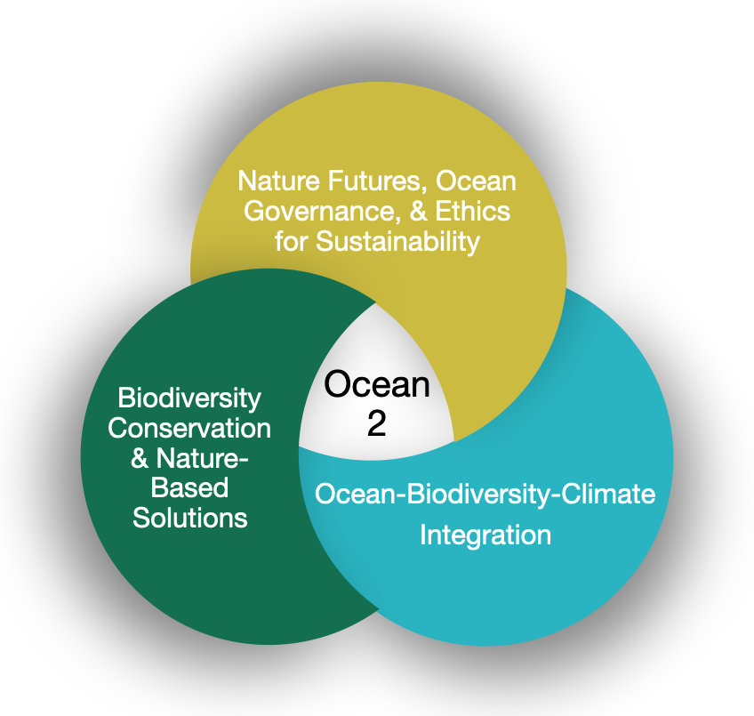
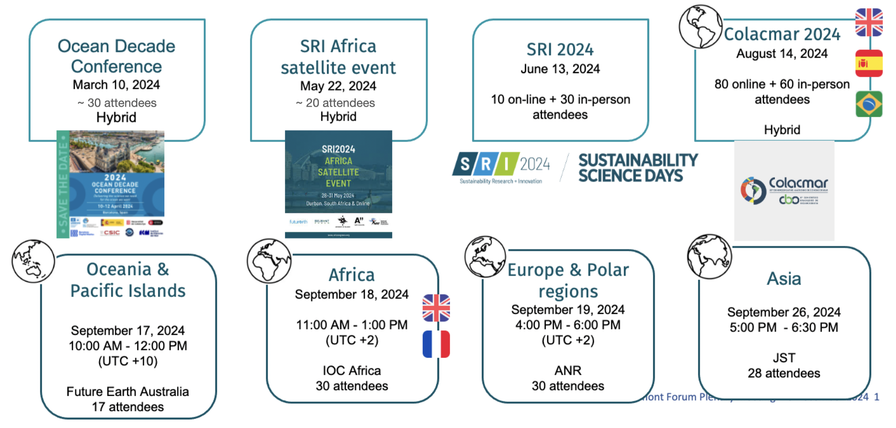
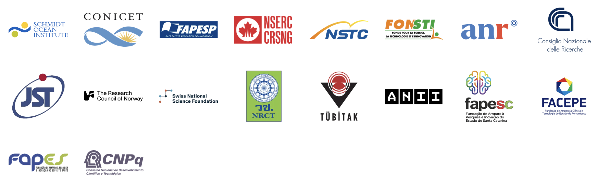

# Towards the ocean we want: biodiversity and ecosystem sustainability for nature and human well-being

## Presentation 

The [Belmont Forum’s OCEAN 2 CRA](https://belmontforum.org/archives/open-opportunity/ocean-2/) supports transdisciplinary research on global ocean challenges. It is a formal contribution to the [UN's Ocean Decade](https://oceandecade.org). Projects are expected to last three years and involve participants from multiple at least three countries, in the social sciences and humatities, natural sciences, and societal partners.

Projects will focus on at least one of these three key topics:

{fig-align="center" width="350"}

## Co-construction of OCEAN 2

Since march 2024, we have presented the concept of OCEAN 2 to the transdisciplinary sustainability research community, such as at the Ocean Decade Conference in Barcelona, the SRI and its satellite event, and conducted 5 regional scoping workshops, one of which at the colacmar conference ; we conducted these events in English, in French, in Spanish and in Portuguese, and collectively, we have about \~ 275 participants at these workshops.

![Collaborative Research Action (CRA) co-design along time, with major milestones (1 to 6). The CRA initiative starts at the national scale and moves on quickly to the international scale. Above the time line are represented the key steps of co-design, below the time line are the governing bodies. “Allenvi”: French Alliance for Environmental Research, “sec:” secretariat. “IOC:” UNESCO’s International Oceanographic Commission. “UNOC3:” 3rd United Nation Ocean Conference. “v.:” version. Step 6 is outside of the co-design process and represents the next steps of the CRA life cycle, as capacity and network building.](ocean2_coconstruction.png)

{fig-align="center"}

## Documents

You can find here the [preprint](https://hal.science/hal-05461552v2) describing the co-construction of Oceans 2, as well as the call text in [French](https://belmontforum.org/wp-content/uploads/2025/06/Ocean-II-2025-1.1.-Call-for-Proposals-FR.pdf?x48233), [English](https://belmontforum.org/wp-content/uploads/2025/06/Ocean-II-2025-1.1.-Call-for-Proposals.docx.pdf?x48233), [Portugese](https://belmontforum.org/wp-content/uploads/2025/06/Ocean-II-2025-1.1.-Call-for-Proposals-PT.pdf?x48233) and [Spanish](https://belmontforum.org/wp-content/uploads/2025/06/Ocean-II-2025-1.1.-Call-for-Proposals-ES.pdf?x48233).

## Funders 

{fig-align="center"}
